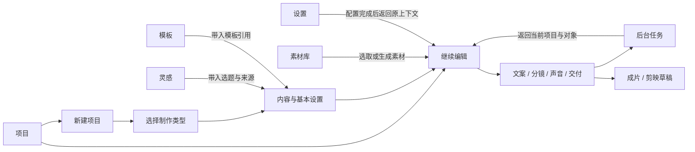

# StoryDream 页面重构详细方案

版本：2026-09-10 · v1。用途：页面设计、功能迁移、开发拆分与验收的执行依据。

## 1. 本轮结论与范围

将 StoryDream 重构为一套共享的 React 创作界面：浏览器和 Electron 使用相同页面、组件与领域逻辑，通过不同运行环境适配器取得文件、生成、渲染和剪映能力。视觉以浅灰白、石墨文字和少量珊瑚色主操作为主，保留深色主题。

项目外只有六个主入口：**项目、素材库、灵感、模板、任务、设置**。项目内以创作阶段组织操作，编辑对象、预览和属性保持联动。复杂配置按对象和阶段展开，减少全屏参数、重复导航与多层卡片。

本轮交付的是详细方案。此前只有共享壳层基础调整和两张概念图完成；本文件内除明确标记“已有”外，均为待实施要求。没有将新导航、全部页面、正式 Web 后端或本机连接器标为已交付。

实施顺序：先形成“项目 → 新建 → 编辑 → 交付”的清晰界面，再完成管理页面与真实本机 Web；公网版另有后端和部署阶段。R1–R9 沿用[总路线](2026-09-10-web-ui-rebuild.md)的编号，本文件仅增加各阶段子项，不另起冲突的任务体系。

### 1.1 设计依据

- 使用已读取的 `ui-ux-pro-max` 与 `storydream-ui` 规则：复用 Fluent 与项目 `src/ui`，语义 tokens、Lucide 图标、稳定的创作工作区、真实视觉回归。
- [首轮设计说明](../design/storydream-web-redesign/review.md)记录了概念图与验证边界。
- [项目首页概念图](I:/opc/.artifacts/storydream-web-redesign/projects-1536x1024.png)用于导航、留白和项目集合的方向沟通。
- [编辑器概念图](I:/opc/.artifacts/storydream-web-redesign/workspace-1024x1024.png)用于工作区关系沟通；正式编辑器采用横向布局，不照搬方形画幅。
- 图片中的项目名、头像、时间、封面和状态是设计示意，不能放进生产界面当成真实数据。

### 1.2 当前问题与已完成边界

| 当前证据 | 对用户的影响 | 本次处理 |
|---|---|---|
| `navigation.ts` 有 18 个侧栏项，另有新建主入口；共 20 个页面视图 | 创作类型、后台任务、实验工具和系统设置混在同一层 | 六入口归类，保留旧视图与跳转 |
| `AppShell` 与导演台各自拥有布局；导演台通过样式隐藏全局壳层 | 返回、标题、工具区和导航规则不一致 | 明确应用外壳与项目外壳两种布局 |
| `styles.css` 约 7000 行，叠加页面规则和重构覆盖样式 | 修改容易互相影响，难以维持一致密度 | 按壳层、组件、工作流迁移样式并清理旧规则 |
| 导演台检查器有模式、生成、字幕、声音、版本、审片六类内容 | 编辑对象的属性与全项目操作并列，寻找操作成本高 | 四阶段主导航，属性按对象显示，版本和审片另有明确入口 |
| 创建页已有 sticky 操作栏，但共享壳层窄屏截图仍有遮挡风险 | 键盘焦点或底部字段可能被操作栏挡住 | 重新定义滚动容器、底部预留与小屏表单布局；不把风险当作所有尺寸已失败 |
| 设置仍有多个配置卡和较长参数区 | 模型、服务连接、全局默认值难分辨 | 左侧分类、右侧分区表单，分开保存/测试/启用 |
| 浏览器当前使用 `makeFallbackApi`，部分能力不可用或为模拟数据 | 页面能打开不代表可以真实生成和写剪映 | 预览环境明确标识；正式运行接受控服务 |
| 构建仍有 Node/undici 的 browser externalization 提示 | 正式浏览器可能触达 Node 依赖或运行时错误 | R6 清理 renderer 的依赖边界，独立验证 Web 构建 |
| 账户与激活是本地资料和模拟状态 | 容易被理解为真实云账户、付费余额 | 标明“本机资料”“本地演示状态”，云身份后续接入 |

以下已有能力必须保留，不作为重新开发的缺陷：

- 长文“按全文分配时长”，保留全部正文；固定时长过快时明确阻断；规划时长和实际旁白时长分别展示。
- MV 的主歌曲必填校验，BGM 不能代替主歌曲；节奏和字幕选项已有中文名称。
- 导演台真实封面空态、单一选中镜头、权威播放时钟、草稿保护、批次恢复、版本归属和审片证据。
- 历史页分页、请求代次、family epoch、删除 tombstone；旧回包不能复活已删除记录。
- 字幕排版/时钟、音频片段裁剪、硬切与转场分组等已完成能力。最新进度已记录 500 段硬切与转场、低帧率、中段取消的限定夹具验收；不再沿用较早“尚未验收”的记录。

现有共享壳层的 183 项回归、Electron 双主题/双尺寸、Web 四尺寸结果只作为壳层基线。它们不证明本方案中的所有页面或移动端编辑器已经通过。

## 2. 信息架构与对象定义

### 2.1 六入口

| 主入口 | 一级内容 | 次级内容与动作 | 不常驻展示的内容 |
|---|---|---|---|
| 项目 | 最近项目、全部项目、收藏、归档 | 新建、按类型筛选、继续编辑、查看产物 | 工作流参数、任务日志、服务密钥 |
| 素材库 | 人物、图片、音频、视频 | 导入、生成图片、生成配音、查看引用 | 各素材的完整参数与生成历史 |
| 灵感 | 热榜、对标、选品、爆款拆解 | 查看来源、保存线索、带入创作 | 登录/Cookie 等连接配置 |
| 模板 | 画面与草稿模板、提示词模板 | 预览、应用、复制编辑、导入 | 当前未选模板的所有参数 |
| 任务 | 进行中、待处理、已结束 | 查看详情、取消、重试、恢复核对、历史记录 | 项目正文与镜头属性 |
| 设置 | 外观、AI 服务、创作默认值、本机与剪映、搜索与来源、关于 | 服务测试、档案启用、路径检查 | 每个项目的临时覆盖参数 |

“账户与设备”放在侧栏底部菜单；本机连接状态放在统一状态入口，点击打开连接面板。任务数只在“任务”入口和项目必要位置显示，不在首页重复堆统计卡。



### 2.2 名称和数据归属

| 对象 | 产品含义 | 数据与迁移规则 |
|---|---|---|
| 项目 | 用户持续编辑的一份创作内容；漫剧可含多集 | 第一轮从已有 task 与工作流文档生成摘要，不新建一份会漂移的项目副本 |
| 任务/运行 | 一次生成、渲染、拆解或批处理执行 | 使用已有 task/run/batch 身份及真实状态；一次项目可以有多次尝试 |
| 产物 | 一次执行得到的图片、音频、视频、报告或剪映草稿 | 保存所属项目、分集、输入版本和执行记录；最新文件不一定属于当前输入 |
| 素材 | 被项目引用或可供再次使用的媒体 | 引用受管理的素材 ID/版本；本机路径由运行环境处理 |
| 编辑草稿 | 尚未提交或尚未持久保存的编辑内容 | 沿用 workspace draft 与离开保护；明确与“剪映草稿”区分 |
| 剪映草稿 | 可供剪映编辑的交付产物 | 交付记录标明目录、素材完整性与生成结果 |
| 模板 | 可复用的提示词或画面设置 | 应用时记录引用/版本，后续改模板不静默改写现有项目 |

当前 `HistoryPage` 有 `task`、`viral-analysis`、`image-lab`、`voice-lab` 四种 family。**只有创作任务进入项目集合**；图片、配音、拆解记录保留在各自工具历史及任务中心历史视图，不全部改名叫项目。

项目摘要第一版复用 `listTasks` 和 `useHistoryPage`。类型过滤、封面、更新时间等若现有摘要合同不够，扩展受控摘要查询和 schema；不能逐条拉取全部项目详情来拼首页。数据库仍只有一份实体，UI 展示层负责新名称。

### 2.3 全部旧页面迁移表

| 旧视图 ID | 现有页面 | 新位置 | 必须保留的行为 |
|---|---|---|---|
| `new-task` | 新建任务 | 项目 → 新建项目 | 智能成片/VOX/漫剧/HTML 创建、草稿恢复、来源带入；补齐 MV 类型入口 |
| `hot-board` | 实时热榜 | 灵感 → 热榜 | 平台筛选、刷新状态、选题带入 |
| `queue` | 自动化队列 | 任务 → 进行中/待处理 | 步骤、审批、重试、取消与真实进度 |
| `history` | 历史任务 | 任务 → 历史记录；创作项目也可从项目集合进入 | 四个 family 的分页、归档、收藏、恢复与删除 |
| `task-detail` | 任务详情 | 项目中的制作详情，或任务 → 执行详情 | 普通成片/MV 当前的详情入口、步骤结果和交付 |
| `editorial-collage` | VOX 视频 | 项目 → VOX 编辑器 | 文案/节拍/图层/声音/版本/审片/输出 |
| `motion-comic` | AI 漫剧 | 项目 → 漫剧编辑器 | 系列、分集、角色造型、场景、道具与一致性 |
| `html-video` | HTML 动画视频 | 项目 → HTML 编辑器 | 自动制作、源码创作、素材、封面、声音、检查与输出 |
| `image-lab` | 画图实验室 | 素材库 → 生成图片 | 参考图、模式、比例、风格、模型选择、记录与重试 |
| `voice-lab` | 配音实验室 | 素材库 → 生成配音 | 服务/音色、试听、生成、克隆能力和记录 |
| `music-mv` | 音乐 MV | 项目 → 新建 → 音乐 MV | 歌曲/歌词/节奏/字幕/画幅；创建后进入既有详情流程 |
| `book-selection` | 选品助手 | 灵感 → 选品 | 榜单、对比、商品资料、证据、收藏与带入创作 |
| `benchmark` | 对标监控 | 灵感 → 对标 | 对标组、分平台同步、作品、指标快照、笔记与选品/拆解 |
| `person-assets` | 素材库 | 素材库 → 人物 | 人物媒体、导入、引用保护与回收恢复 |
| `viral-analyzer` | 爆款拆解 | 灵感 → 爆款拆解 | 来源处理、运行、报告、历史、转任务和保存模板 |
| `prompt-templates` | 提示词模板 | 模板 → 提示词 | 系统模板、复制、编辑、JSON 导入与草稿保护 |
| `draft-templates` | 草稿模板 | 模板 → 画面与草稿 | 画布/图层/字幕/音频、Coze 导入、预览和保存 |
| `settings` | 系统设置 | 设置 | 全部原分区、测试/保存/启用、返回原任务 |
| `account` | 账户中心 | 底部菜单 → 本机资料 | 资料与本地状态；不冒充云登录 |
| `activation` | 激活管理 | 底部菜单 → 授权信息；设置兼容入口 | 本地激活编辑与说明；不冒充真实购买 |

六入口是导航结构，不意味着将 20 个视图合并成六个巨型组件。首批保留旧 `ShellView` 解析；新增集合入口时同步更新 `SHELL_VIEWS`、route registry、`AppRoutes`、导航标题、偏好 schema、IPC 偏好校验和测试。旧保存视图或入口失效时提供可解释回退。

## 3. 两种外壳与布局规范

### 3.1 应用外壳：浏览与管理

适用于项目集合、素材库、灵感、模板集合、任务中心和设置。

- 左侧导航目标宽 220px，六入口加底部菜单；新建项目为主动作。项目页顶栏不再重复第二个同权重的“新建”。
- 页面头部 64–76px：标题与一句必要说明、当前页面搜索、少量操作。搜索默认只查本页，不提供没有后端支持的全局万能搜索。
- 内容区按页面使用集合、表格或分区表单；常规左右留白 24px，紧凑尺寸 16px。
- 集合可用缩略图卡，参数和配置用 Pane、分隔线、表单行；不在每一层再套有阴影的卡片。
- Electron 的 32px 窗口栏独立于网页布局；拖拽区域避开按钮。浏览器不显示最小化/最大化/关闭控件。
- 页面正文只有一个主要滚动容器；表格内部横向滚动必须局限在表格区域，页面本身不得横向溢出。

### 3.2 项目外壳：持续创作

适用于普通成片制作详情、VOX、漫剧、HTML、MV 的项目流程。

```text
项目顶栏  返回项目 | 名称 / 类型 / 保存状态        任务摘要 | 更多
阶段栏    文案            分镜            声音            交付
工作区    对象列表        预览 / 当前编辑内容              当前对象属性
          镜头或段落      播放控制 + 时间轴               按需展开高级项
```

- 编辑器不常驻完整应用侧栏，保留“返回项目”与必要的任务入口；不能同时出现两套项目标题和阶段导航。
- 顶栏目标高 56px，阶段栏 40–44px；保存状态常驻。主操作由当前阶段提供，避免顶栏、画布、右栏同时出现多个主色生成按钮。
- 1440px 宽参考：左对象栏 240px、右属性栏 300px，中间使用剩余宽度。允许调整栏宽，并在断点变化时夹取到有效范围。
- 预览按项目真实画幅适配可用宽高，竖屏保持完整边界；播放器控件在画布外，不覆盖字幕。
- 时间轴初始高约 180px，可收起/调整；它是现有时间线的表现层，继续使用 `playbackMs` 和真实 clip/cue 时长。
- 镜头列表和属性面板可各自滚动；中央画布不随右侧长表单被挤走。每个滚动区都必须能用键盘进入和离开。
- 面板切换只改变视图，不重置选中镜头、播放位置、未保存内容或正在运行的任务。

### 3.3 响应式规则

| 视口 | 浏览/管理页 | 项目编辑器 |
|---|---|---|
| ≥1280px | 完整 220px 侧栏；集合/表格使用可用宽度 | 三栏；允许同时看对象、画布、属性 |
| 1024–1279px | 侧栏可收为 64px 图标栏，展开显示文字；保留可访问名称 | 左栏约 200px；右属性改抽屉，默认给预览空间 |
| 768–1023px | 导航抽屉；筛选可换行；设置分类改选择器 | 预览与列表切换，属性独立面板，避免压缩三栏 |
| <768px | 单列集合、简化任务列表；主动作触达区至少 44px | 文案、项目查看、状态、审片可用；精细多轨编辑提示使用宽屏，数据完整保留 |

QA 基准：1440×900、1024×768、768×1024、390×844；Electron 加现有 1080×720 紧凑基线。不能通过将文字缩到 9/10px 来容纳窄屏。

表单底部操作栏使用所属滚动区内的 sticky，预留实际栏高、安全区和 `scroll-padding-bottom`；聚焦最后一个字段、浏览器缩放 200%、虚拟键盘弹出时，字段和错误说明仍能滚动到可见位置。抽屉关闭后焦点回到触发按钮。

## 4. 视觉与交互系统

| 项目 | 规范 |
|---|---|
| 浅色基线 | 背景 `#FFFFFF`、次表面 `#F6F7F8`、边界 `#E2E5E8`、正文 `#202326`、次文 `#687078`、主色 `#CF4938`；引用现有语义 token |
| 深色与预览 | 保留现有深色偏好；预览画布用 `--media-*`，不随管理页浅色变成浅底；Fluent 与 CSS 配色一致 |
| 字体 | 系统中文/Segoe UI 字体栈；正文 14px、辅助及状态至少 12px、工具标题 16px、页面标题 22px；长正文行高约 1.6 |
| 间距与圆角 | 间距 4/8/12/16/24/32px；控件 4–6px、容器 6–8px；阴影主要用于浮层 |
| 控件 | 复用 `src/ui` 的 Button、IconButton、Field、Tabs、Menu、Dialog、Toolbar、Pane；不引入第二套 UI 库 |
| 操作权重 | 一个当前主动作；次操作描边/文字；删除在更多菜单或详情中，不与生成同等突出 |
| 图标 | Lucide 16/18/20px；图标操作有 tooltip 和可访问名称；选中同时有形状/边界及语义 |
| 色彩语义 | 珊瑚色用于主动作/选中；成功/警告/错误使用语义色加文字；轨道颜色不承担唯一状态信息 |
| 动效 | 面板/焦点反馈约 120–180ms；支持减少动效，不加入持续闪烁与大幅布局运动 |

完整状态约定适用于后续每页；页面小节列出其特殊行为：

| 状态 | 统一表现与恢复路径 |
|---|---|
| 初次加载 | 保持布局骨架，显示正在读取；不能暂时显示“暂无记录” |
| 首次空白 | 说明缺什么，提供一个开始动作；空封面不使用假图片 |
| 筛选无结果 | 保留筛选条件，提供清除筛选；不等同首次使用 |
| 局部失败 | 错误靠近对应对象，摘要说明原因和下一步；技术详情可展开并脱敏 |
| 服务未配置/能力不可用 | 标明所需能力，去设置/连接/上传；保留已输入内容，不点完才告诉用户不支持 |
| 执行中 | 只有受影响操作忙碌；可查看其他项目；进度来自真实步骤，未知剩余时间不编造倒计时 |
| 部分完成 | 明确完成数、失败数、待核对数；重试只处理合法范围，不重复全部付费生成 |
| 保存中/失败 | 区分未保存、保存中、已保存、保存失败；失败保留草稿和重试入口 |
| 旧产物/过期报告 | 显示所属版本与时间，并提供重新生成/复检；不标成当前通过 |
| 断连 | 显示最后同步时间；区分连接断开与服务器任务失败；恢复后先核对状态 |
| 删除/归档 | 归档可恢复；永久删除按实际不可逆范围确认；引用阻断和恢复遵循现有规则 |

无障碍要求：普通文字对比度至少 4.5:1，关键边界/焦点至少 3:1；键盘可访问所有主操作，Tabs 支持方向键，菜单支持 Escape；错误信息关联字段，异步反馈使用合适的 live region。不能只依赖 hover、颜色或短暂 toast 传达任务失败。

## 5. 逐页规格：项目与创作

下列 P 编号只是页面规格定位号；开发任务仍使用第 9 节的 R 阶段编号。每页继承第 3、4 节的布局、状态和无障碍要求。

### P01 项目首页

**目标：** 打开软件后知道正在做什么，能迅速继续或新建。

- 默认“最近使用”，提供全部、收藏、归档视图；顶部一行搜索、制作类型筛选和网格/列表切换。首页不放余额、平台动态或大块运行统计。
- 项目卡只呈现真实封面、名称、类型、更新时间、必要状态。时长未知显示“尚未生成时间线”；无封面使用中性占位与文字。
- 点击卡片继续编辑，更多菜单提供当前已支持的收藏、归档、恢复等；永久删除只在相应归档上下文提供。重命名/复制若需要新 API，应作为实际子任务，不能显示空操作。
- 进行中的项目显示实际阶段及任务入口；运行任务不能把同一项目重复插入集合。返回首页保留查询、筛选、滚动和焦点。
- 历史旧项目缺少某些新摘要字段时允许打开，按缺失信息显示空值，不以假日期/图片补齐。

**数据 owner：** 现有 task 存储、分页查询与 reconciliation；拟新增 `features/projects` 仅负责摘要组合和页面。封面查询必须有批量/摘要支持，分页第一页先呈现，禁止加载全部正文。

**验收：** 五类创作类型均可创建后从首页重开；分页、归档、搜索无结果、缩略图失败、删除后旧回包、500 项摘要的加载行为可核验；每个结果卡拥有键盘可用的主链接。

### P02 新建项目

**目标：** 先选制作方式，再填必要内容，明确开始后会发生什么。

采用三步全页流程：

1. **制作类型：** 智能成片、VOX 视频、AI 漫剧、HTML 动画、音乐 MV。每项仅名称、一句话用途和图标，五项同级；先从原四类选择器补齐 MV。
2. **内容：** 名称、正文或对应类型输入、来源引用。漫剧填系列设定与首集；MV 选择主歌曲和歌词；HTML 允许正文/素材驱动。保留从热榜、选品、对标、拆解与模板带入的内容。
3. **制作设置：** 画幅、模板、时长策略和本次会执行的步骤。模型、采样、并发和服务路径进入高级设置或全局设置；摘要显示实际启用档案。

操作栏固定在当前表单的滚动区域内，提供“上一步”和一个主动作。底部清楚显示“创建并进入编辑”或“创建并开始生成”，按实际 handler 命名；不能用同一个含糊的“创建”同时承载收费执行与只保存两种行为。

**时长规则：** 对文字驱动且支持全文规划的工作流，默认“按全文分配时长”，保留 15/30/60 秒固定目标。展示字数、最低预计朗读时长和估算速度；固定目标容不下时给出编辑原稿或改全文分配的入口。MV 使用歌曲实际时长；不把所有类型强行套用同一时长算法。实际旁白生成后的差异在声音阶段展示。

**状态与返回：** 切类型前保留各类型的输入草稿；离开、刷新和打开服务设置遵循草稿保护。创建失败保留所有字段，首次无素材明确引导导入；回到来源页不丢其筛选上下文。

**数据 owner：** 共享向导只协调步骤、校验摘要和路由；各类型仍调用原创建合同，不另造一份全能 document schema。现有 `workspace-draft` 和 `workspace-navigation` 继续控制草稿与离开。

**验收：** 五类入口全部可达；重复提交不创建重复任务；长文全文不丢字；MV 无主歌曲不能提交；1024×768 与 390×844 下最后字段/错误/按钮均可见；设置返回与失败恢复保留输入。

### P03 智能成片工作区与通用制作详情

**目标：** 看懂当前步骤、检查阶段结果并处理失败。

- 项目顶栏显示名称、类型和状态；主区按内容、分镜/素材、声音、交付组织既有结果。未开放编辑的阶段显示结果与现有操作，不能画出不能工作的编辑控件。
- 中央优先展示当前有用的产物；步骤清单放在辅助区。完整事件日志收进“执行详情”，不占满第一屏。
- 卡住时在阶段位置显示阻断原因、所需输入和恢复动作；重试说明是当前步骤的新尝试还是整体重新执行。
- 项目编辑入口和任务执行详情共享 task 数据，但视图角色不同；从任务中心进入详情可“返回任务”，从项目首页进入则“返回项目”。

**迁移依据：** `TaskDetailPage` 与现有 task pipeline；普通任务和 MV 当前仍通过 `taskWorkspaceView` 进入该页。第一版可先在新项目外壳中呈现现有详情，再逐步抽离阶段区。

**验收：** 草稿、运行、待处理、失败、取消、完成六类真实样本；已有产物可看；单步重试范围正确；无渲染能力时显示能力缺口；打开剪映与草稿生成分别报告结果。

### P04 导演台共享编辑器

**目标：** 左侧选对象、中间看结果、右侧改当前对象；在同一项目持续完成创作。

| 主阶段 | 常驻内容 | 本阶段主动作 | 二级内容归处 |
|---|---|---|---|
| 文案 | 完整原稿、段落/节拍结构、时长策略和规划摘要 | 按实际状态显示“生成分镜”或“更新分镜” | 文案辅助、来源、全局风格折叠；重规划先展示受影响内容 |
| 分镜 | 镜头列表、画布、时间轴、所选镜头的画面/图层属性 | 生成所选镜头；批量动作进入范围面板 | 服务参数/并发在批量面板；字幕快捷设置为对象属性 |
| 声音 | 旁白/对白/BGM/音效列表、片段时间、试听、实测时长差异 | 生成或导入当前所需声音 | 混音细项按轨道/片段展开，模型档案去设置 |
| 交付 | 当前预览、质量结论、产物版本和输出设置 | 检查准备情况后生成成片或剪映草稿 | 详细证据、历史输出、局部复检和诊断按需打开 |

原六个检查器入口这样迁移：**模式**到项目设置/当前画面策略，**生成**到镜头与批量面板，**字幕**到镜头属性并可从声音阶段定位，**声音**到声音阶段，**版本**到当前对象历史及交付产物历史，**审片**到交付阶段。它们保留可达性，不再与四阶段同时形成两层常驻导航。

核心操作和状态约束：

- `selectedShotId` 是单一选择来源，画布、属性、字幕 cue 与左侧滚动定位一起更新；多选批量范围与当前主选对象分别表达。
- 播放使用已有 `playbackMs`；删除、拆分、合并、重排后保留合法选择与时钟，不能新造一套展示用时间数据。
- 空画面显示“尚未生成画面”及操作；加载、解码失败、资源丢失各有明确状态和重试/重新关联。可查看关联素材，并能切到全部素材。
- 当前支持的画面策略继续限定为 `deterministic-layers` 与 `living-poster`；不因重构开放未完成的混合策略。
- 批量面板先显示项目/分集、范围、节点数、能力缺口、预算和并发。不能将当前镜头动作误用于整个系列。
- 成本只显示 provider 返回值或明确标记的估算；未知时显示未知，不能由模拟积分推算费用。
- 保存中不能被旧回包改写新稿；切项目、切集、切图层后，异步响应必须核对任务、对象、版本和请求代次。
- 版本应用会改变当前对象时进入已有草稿/版本处理路径；旧报告显示“过期”，人工确认绑定报告与输入版本。

**数据 owner：** `DirectorDeskWorkspace` 保持表现与交互，VOX/漫剧页拥有领域文档；现有 generation、batch、request gate、字幕/声音模块继续承担业务。建议抽出 ProjectHeader、StageNavigation、ShotList、PreviewPane、InspectorHost；这些是拟建 UI 部件，不改变现有 document owner。

**验收：** 切镜头不串属性；播放与字幕同步；拆合重排后保存重开一致；生成中切项目/集不串数据；部分失败只重试选定范围；224 镜头长文和 500 镜头列表测量；历史/审片可定位到原镜头；双画幅/双主题/紧凑尺寸实际截图。

### P05 VOX 视频

**目标：** 将解释型文案组织成可读节拍与视觉表达。

- 文案阶段突出全文、节拍和时长；分镜阶段按节拍组织镜头，当前节拍与当前镜头能明确区分。
- 叙述者、地点、历史影像、风格参考、一致性设定保留为素材类别；默认先看相关素材，并有“全部素材”入口。
- 图层、标题、字幕、相机关键帧与动态海报在镜头属性中按所选对象出现；不常驻展示其他镜头的所有图层参数。
- 从原稿重新规划时先显示影响范围，明确哪些手动镜头/字幕会更新；不在用户修改全文时立即静默覆盖已编辑分镜。
- 交付保留字幕安全区、旁白对齐、媒体/切点证据和当前版本状态；报告中的机器采样与人工语义复核分别表述。

**数据 owner：** `EditorialCollagePage`、editorial document 与现有 production 逻辑。正文、cue、镜头时间仍使用既有持久化关系。

**验收：** 全文原稿、节拍与字幕保存重开一致；横竖预览、实际输出和标题安全区不回退；无真实封面维持空态；用户的全文时长选择保持。

### P06 AI 漫剧：系列、分集与角色

**目标：** 分清跨集设定与本集编辑，避免系列大表单长期挤占工作区。

- 系列打开后先展示分集列表与继续编辑；进入分集后使用导演台。项目顶栏显示系列名和分集选择器，生成/导出位置明确标注“当前集”。
- “系列设定”作为独立页面，页内导航为故事设定、角色、场景、道具。每类使用集合 + 单项详情，不一次展开所有角色造型与场景参数。
- 角色详情分身份、造型、参考图、声音映射、被引用情况；镜头只引用角色/造型 ID，临时修改不得悄悄重写跨集身份。
- 本集文案区显示场景与对白，分镜显示对白归属、说话角色和画面引用；声音阶段可按角色处理对白片段。
- 新建集、调整场景/镜头、拆合对白保持现有能力；删除被引用资源时显示实际引用并遵循保护规则。
- 从当前镜头去维护角色，返回后恢复当前集、镜头、阶段和草稿。系列设置改动影响旧输出时，原产物可查看并明确版本关系。

**数据 owner：** `MotionComicPage`、`activeEpisodeId`、episodes/characters/sceneAssets/props 和既有一致性规则；新系列页面只拆视图，不复制系列文档。

**验收：** 至少两集往返编辑及生成中切集；新增场景/镜头后选择正确；同一角色多个造型不串引用；对白和音频裁剪在拆合后保持；当前集报告不使用其他集最新报告。

### P07 HTML 动画视频

**目标：** 普通使用者先完成内容与预览，高级使用者可以继续编辑源码。

- 沿用创建/项目两种状态，新建入口归入 P02。项目内用“内容、画面、声音、交付”四阶段，允许类型特有名称，不强行显示没有含义的分镜字段。
- 原文案/素材/动画等内容映射到对应阶段；封面放在交付的“封面”分区，输出比例、字幕版式和预览错误各有归处。
- 默认自动制作；“编辑动画源码”为明确的高级入口。进入后使用片段列表、预览、源码/属性/检查面板，渲染队列从任务入口打开。
- 源码报错提供文件/片段/位置与检查结果；保存、检查、预览、正式渲染分别表示不同操作，不用绿色“已检查”冒充成功出片。
- HTML 预览保持沙箱和资源访问边界，加载本地资源由媒体适配器处理；禁止为方便预览开启宽泛 Node/文件访问。
- 源码与自动模式切换继续调用离开保护；上一次有效预览和本次编译失败分别展示，不能把旧预览误认作刚保存的结果。

**数据 owner：** `HtmlVideoPage`、`HtmlVideoAuthoringWorkspace` 与 HTML pipeline/composition 模型；沿用独立渲染合同，不转存为 VOX 文档。原生裸按钮随该页迁移改为 `src/ui`。

**验收：** 自动制作到交付完整路径；源码编辑/保存失败/切模式/重开；资源加载和检查定位；封面生成失败可重试；旧预览标识；本机/浏览器媒体 URL 均可加载。

### P08 音乐 MV

**目标：** 以歌曲和歌词组织制作参数，而不是长表单堆叠。

- 新建页第一屏依次为主歌曲选择、歌曲信息/可播放验证、歌词。主歌曲必填，BGM 明确为辅助配乐。
- 画幅、视觉风格、节奏模式和字幕样式组成基础设置；模板、场景数量、视觉母题、暂停节点及处理模式进入高级设置。
- 主歌曲探测到实际时长后显示项目预计覆盖范围；歌词同步有实际对齐证据才显示“已对齐”。仅按文字估算时显示估算，不能画出假波形或假打点。
- 创建后首批进入新外壳中的既有制作详情；歌词、画面、声音、交付的进一步分区基于已有数据逐步提取。完整专业歌曲剪辑器不纳入第一批 UI 交付。
- 音源丢失、无法解码、歌曲时长与字幕明显不符时给出对应修复入口；选择新歌曲后提示重新计算受影响结果。

**数据 owner：** `MusicMvPage` 的创建草稿与 task pipeline；保留 `musicMvAudioPath` 的业务要求，浏览器导入后由 adapter 转为服务端受管理素材引用。

**验收：** 新建第五类型可达；无主歌曲不可提交；主歌/BGM 不混淆；歌词长表单保存重开；中文节奏/字幕名称保持；任务执行和产物返回路径完整。

## 6. 逐页规格：素材、灵感、模板与管理

### P09 素材库与人物详情

**目标：** 找到已有素材，知道用在哪里，并能导入或生成新的素材。

- 默认集合视图，顶部分类为人物、图片、音频、视频，另有来源/项目筛选。未接入索引的类型显示真实空态与接入说明，不伪造“全盘素材已收录”。
- 工具栏主动作是导入；“生成图片”“生成配音”是次级入口。批量操作只在选中后出现。
- 缩略图下显示名称、类型/时长、来源与必要状态；点击后打开预览和详情，展示被引用项目、版本与管理操作。
- 人物列表进入人物详情：身份信息、参考图集合、相关素材和使用情况。引用中的媒体删除沿用阻断/回收逻辑，不直接移除磁盘文件。
- 从编辑器打开素材选择器时带入类型/画幅/当前对象上下文，主动作“使用此素材”；应用后返回原项目与镜头。独立素材库浏览不自动改项目。

**数据 owner：** 现有人物库、实验室记录及 production assets；第一版统一查询展示，逐类补可分页的受管理媒体索引，不复制文件或用任意磁盘扫描代替素材管理。

**验收：** 导入失败、同名素材、失效路径、分页与引用查询；人物回收恢复；从镜头选择素材后返回位置正确；浏览器上传获得可用媒体标识，不能假设文件选择提供本机绝对路径。

### P10 生成图片

**目标：** 写提示词、选择参考与必要规格、查看结果。

- 宽屏左侧约 320px 生成表单，中间结果画廊；窄屏表单与结果分区切换。结果加载时保留已完成图片。
- 常驻提示词、参考图、比例、生成数量；模式/风格以简洁选择器呈现。服务、分辨率、质量及更多参数折叠，展示当前配置摘要。
- 保留现有智能模式、普通生成、参考图粘贴/导入、提示词模板与历史；生成结果支持预览、查看本次参数、按原参数重试和受支持的导出动作。
- “使用到项目”先选择目标项目/对象，或从原项目上下文返回；失败记录没有图片时显示原因，不使用示例图填充。

**数据 owner：** `ImageLabPage`、image-lab family、现有工作区草稿/记录；全历史使用分页接口，首页状态快照数量不能标为全部历史总数。

**验收：** 多比例/多风格输入、参考图、部分返回失败、取消/重试能力按实际合同显示；切历史记录不串详情；生成前后的参数与产物关联明确；页面不保存凭证。

### P11 生成配音与音色

**目标：** 快速选对服务与音色，听到可用结果。

- 常驻文本、服务选择、音色选择、试听与生成按钮；音色列表支持服务内筛选，不把音色 ID 当成服务名。
- 当前音色展示名称、服务、语言及实际可得的试听；速度/音量/高级音频参数按需展开。克隆入口只在已有能力和前置条件满足时显示可执行状态。
- 结果列表显示真实时长、生成时间和状态；可播放、导出、查看详情与返回项目应用。没有波形数据时使用普通播放器。
- 在服务设置修改后返回原文本与音色上下文；服务切换导致音色失效时要求重新选取，不静默保留另一个服务的 ID。

**数据 owner：** `VoiceLabPage`、voice-lab family 与原 TTS/音色合同。

**验收：** 服务与音色语义、无配置、空试听、音频解码失败、重复点击、长文本、切服务和草稿恢复；有效音频时长与记录一致。

### P12 灵感：热榜

**目标：** 从来源清楚的热点中选题。

- 顶部平台/频道、关键词和刷新；列表显示标题、来源、实际更新时间和可得指标；条目详情显示摘要、来源链接与选题动作。
- 页面主动作随上下文是刷新或“带入创作”，不在每一行放醒目的主色按钮。
- 刷新失败保留旧结果并标注更新时间/过期状态；无数据与平台未提供指标分开显示，缺失数值用“未提供”，不用 0 代替。
- 带入创作只传选择的内容和来源上下文，进入 P02 可编辑草稿；不能直接覆盖已打开项目。

**数据 owner：** `HotBoardPage` 的现有来源与任务带入合同。

**验收：** 平台切换、首次加载、局部源失败、旧数据、无结果；来源与时间可辨认；返回后仍在原筛选位置。

### P13 灵感：对标

**目标：** 以对标组管理作品和证据，继续进入选品/拆解/创作。

- 宽屏左侧对标组，中间作品列表，右侧选中作品详情；紧凑尺寸把详情改抽屉，组切换改选择器。
- 常驻平台、搜索、收藏和同步状态；分平台账号状态独立显示，账号连接/登录集中在组设置中。
- 作品显示标题、时间、指标快照和采集时间；详情显示来源、笔记、工作流状态及拆解/加入选品/创作动作。
- 同步操作仅影响对应组；部分平台未接入或权限不足显示真实原因。当前视频号连接器未接入的动作继续受限，不通过视觉重构假装支持。
- 笔记编辑、批量选取、手动导入作品、组管理全部保留；长技术信息收进详细说明。

**数据 owner：** `BenchmarkImportPage`、groups/posts/accounts；查询与详情请求必须有当前组/作品归属校验。

**验收：** 多组切换、同步中离开、三平台独立状态、缺失指标、笔记保存失败、批量带入以及返回上下文；登录能力区分 Electron/本机服务/公网。

### P14 灵感：选品

**目标：** 从榜单和证据做选择，形成可用的创作简报。

- 默认榜单或收藏集合；搜索/赛道/分类/状态为单行筛选。详情按商品资料、机会判断、对标证据分区。
- 对比为独立视图，只在选中两项或以上且现有合同支持时启用；不常驻空白比较栏。
- 手动添加和编辑使用详情页或抽屉，保留字段、证据与收藏；“带入创作”显示将带入的简报范围。
- AI 推断的机会评分明确为建议；平台事实指标、手动输入与生成判断保持来源标识，避免都显示成确定事实。

**数据 owner：** `BookSelectionPage`、BookSelectionIdentity/Record、discovery 和现有 evidence；不因新列表改掉主题/图书标识的复合归属。

**验收：** 榜单/收藏/对比/详情往返；发现失败保留手动资料；从对标补证据后返回原条目；带入内容准确且能修改。

### P15 灵感：爆款拆解

**目标：** 输入来源、查看结构化报告，再进入创作。

- 开始页只保留来源输入与必要的解析方式；赛道、风格、画幅等创作配置在“基于报告创作”时集中设置，避免分析前堆满成片参数。
- 运行时中央显示实际步骤与可用结果；报告按开头、结构、关键帧、结尾、可复用提示词组织。
- 历史列表可收起；当前报告和对应历史 ID 固定关联。重试、转制作任务、保存为模板保留实际合同。
- Cookie 文件/登录窗口放进来源连接设置；公网版本不能直接读本机 Cookie 路径，必须由具备相应能力的环境处理。

**数据 owner：** `ViralAnalyzerPage`、viral-analysis family 与现有分析结果。

**验收：** 无效来源、登录缺失、解析失败、部分报告、切历史旧回包、重试、转项目/模板；报告不能把手动调整的状态当成重新分析完成。

### P16 模板中心：提示词

**目标：** 找到用途合适的模板，明确应用范围和编辑状态。

- 模板中心分“提示词”和“画面与草稿”。提示词页使用左列表、右编辑区；顶部按用途/来源筛选。
- 系统模板只读，提供复制编辑；自定义模板支持名称、适用阶段、正文与变量说明。保存和应用是两个不同操作。
- JSON 导入先展示可解析项、错误和重复处理；覆盖已有模板必须明确，失败不能留下半份模板或丢失当前未保存文本。
- 从项目进入模板选择时提供“应用到当前阶段”，独立管理时只管理模板；应用前明确替换哪些提示词。

**数据 owner：** `PromptTemplatesPage` 和原模板存储/草稿保护。

**验收：** 系统模板保护、复制/导入/非法 JSON/重复项、保存失败、切模板与离开、返回项目；多模板编辑不串草稿。

### P17 模板中心：画面与草稿

**目标：** 看见模板效果，按画布对象编辑参数。

- 集合页显示真实模板预览与名称、画幅、来源。编辑器使用左图层列表、中画布、右当前图层属性。
- 画布、图片区域、运镜、分栏、主标题、副标题、字幕、免责声明、音频全部保留；未选对象的参数默认收起。
- 点击画布对象同步选择对应属性，并提供键盘/图层列表替代选择。预览使用明确的模板示例内容，不能显示为用户项目产物。
- Coze 导入是独立导入流程，显示转换结果与不支持项；效果目录从本机取得失败时标明使用内置目录，不宣称已匹配本机全部效果。
- 保存、复制、设默认与应用到项目在文案和实际操作上区分。

**数据 owner：** `DraftTemplatesPage`、template detail cache、selectedLayer 和已有动画预览逻辑。

**验收：** 画布选择与属性一致；模板切换和未保存保护；导入部分失败；横竖模板预览与实际字段保存；本机效果能力与浏览器降级正确。

### P18 任务中心、执行详情与历史

**目标：** 看清什么在运行、哪里需要处理以及已有结果在哪里。

- “进行中、待处理、已结束”组织执行列表；历史入口保留四个 family 的查询和归档记录。
- 一行显示名称、所属项目/类型、当前阶段、状态、更新时间和必要动作。日志、provider job ID、完整异常详情在选中任务的详情页。
- 全局队列不常驻覆盖编辑器；项目顶栏可打开仅当前项目的任务面板，再进入全量任务中心。
- 进度区分“步骤执行中”与“已完成步骤”，不把运行位置当成完成比例；等待外部状态时显示“待核对”。
- 恢复已有持久化批次必须先核对远端状态，只续跑未完成节点；取消中、已取消与失败分开。连接丢失不能立即改为失败，也不能自动重复提交。
- 归档属于记录整理，取消属于运行控制；永久删除先按引用与受管理目录规则检查。

**数据 owner：** `QueuePage`、`HistoryPage`、`TaskDetailPage`、task-progress、批次持久化与事件 reconciliation；保留 task/runGeneration/seq 隔离和 family tombstone。

**验收：** 初次/分页加载、重复/乱序/延迟事件、跨任务相同 seq、重启后核对、删除旧回包、取消后残余事件、部分成功；从失败项回到正确项目、集、镜头及阶段。

### P19 设置与服务档案

**目标：** 让用户知道改的是全局默认值、连接信息还是当前启用档案。

宽屏采用分类栏 + 单个分区表单；每个分区底部有保存状态和必要操作。小屏使用分区选择器，避免一屏铺满全部配置卡。

| 新分类 | 旧分区/内容的归属 |
|---|---|
| 外观 | `appearance`：主题与界面偏好 |
| AI 服务 | `llm`、`image`、`video`、`tts`、`speechToText`：按服务类型管理档案 |
| 创作默认值 | `creative`：自动化、预算、默认风格等；项目可覆盖的值明确标识 |
| 本机与剪映 | `jianying`：剪映、渲染依赖、路径、BGM 目录；新增连接面板入口 |
| 搜索与来源 | `webSearch` 及现有 IMA/来源连接等配置 |
| 授权信息 | `activation` 兼容入口，说明本地状态范围 |
| 关于 | `about`：版本、诊断与实际支持能力 |

- “保存”持久化输入，“测试连接”验证当前明确的输入/档案，“设为当前”切换启用对象；测试通过不自动等于已保存或已启用。
- 密钥默认遮罩，日志/复制诊断脱敏；连接状态显示测试时间和测试对象，编辑关键字段后旧测试结果标为过期。
- 本机路径配置在对应能力存在时可浏览选择；浏览器使用上传/服务端目录选择，不显示不能工作的本机文件选择按钮。
- 从项目的能力提示进入指定分区，完成后“返回项目”恢复 taskId、阶段、镜头、分集与编辑草稿；旧 `openSettings(section, returnView, taskId)` 链路迁移时扩展上下文而不是只记一个页面名。

**数据 owner：** `SettingsPage`、`ProviderProfileManagers`、现有 config/preferences/theme owner；Web 阶段凭证写入后端保管，renderer 只接收遮罩/存在状态及受限结果。

**验收：** 全部旧分区可达；保存失败不丢字段；测试与档案匹配；从编辑器进入返回；旧主题偏好有效；长错误文本和 200% 缩放不遮按钮。

### P20 本机资料与授权信息

**目标：** 保留已有本地资料入口，准确表达账户能力。

- 侧栏底部菜单放“本机资料”“授权信息”“关于”。资料页使用短表单展示名称、设备和已有本地字段。
- 当前模拟余额/试用信息归入明确标识的本地演示信息，不在首页、编辑器、生成预算中作为真实账户额度。
- 授权页保留已有激活状态编辑和说明；公网身份、订阅、真实账单只有 R8 接入后才能展示相应能力。
- 不设计无真实动作的“充值”“购买”“云同步成功”按钮。旧 account/activation 路由继续可达。

**数据 owner：** `AccountPage`、`ActivationPage` 与当前本地状态；未来云身份另有版本化合同。

**验收：** 旧资料持久化和路由兼容；本地/云状态文案可区分；没有真实付费状态冒充；小屏表单可用。

## 7. Web、Electron 与本机剪映连接

### 7.1 能力分层

共享 renderer 只能调用 `StoryDreamApi` 与运行环境适配器，不直接 import Node、Electron、文件系统或任意 IPC。页面通过 capability handshake 决定显示哪些动作；能力不足时仍可编辑草稿、查看已有数据或导出可迁移包。

| 能力 | Electron | 本机浏览器连接器 | 纯浏览器/公网第一阶段 |
|---|---|---|---|
| 项目/设置/编辑器 UI | 可用 | 可用 | 可用 |
| 本地文件选择与读取 | preload 受控 API | 本机服务受控 API；浏览器只拿媒体引用 | 上传或对象存储 |
| FFmpeg/本地流水线 | 主进程/本地 sidecar | 本机服务进程 | 云任务或不可用 |
| 写入剪映草稿 | 本地服务 | 本机服务 | 下载草稿包/导入 |
| 启动剪映 | Electron 主进程 | 连接器尝试启动并单独报告 | 不可用 |
| 查看本机路径 | 受控、脱敏 | 只显示受管目录/别名 | 不显示本机绝对路径 |
| API 凭证 | 安全存储/主进程 | 本机服务保管 | 后端密钥保管 |

当前 `runtime-capabilities.ts` 只实现 Electron 和 browser fallback 检测；`browser-companion` 仍是规划能力。仅填写地址或 token 不能把 fallback 变成已连接。

### 7.2 R6：适配器与合同拆分

1. 把 renderer 依赖分为浏览器纯合同、Electron adapter、本机 HTTP adapter；先为 `getBootstrap`、任务/媒体 URL、事件订阅、草稿交付建立版本化合同。
2. 请求统一携带 `requestId`、项目/分集/对象 ID、文档版本和能力范围；响应带 `serverRevision`/任务代次。取消、超时、断连和重试不由 UI 猜测状态。
3. 事件订阅按 task/runGeneration/seq 隔离；重连先请求快照与 revision，再接增量。渲染器只收到短时媒体 URL 或受控代理 URL，不接受任意 `file://`。
4. 浏览器构建中禁止 Node polyfill 和宽泛 `window` API；CI 设依赖检查，发现 renderer bundle 包含 Electron/Node 模块时失败。
5. fallback 保留为演示/评审模式，所有不可用动作显示能力说明；不能把 localStorage 模拟记录当成正式服务已写入。

### 7.3 R7：本机浏览器连接器

**推荐形态：本机服务同时提供页面静态资源和受控 API。** 用户在本机启动 StoryDream companion，再用浏览器打开 `http://127.0.0.1:<port>/`。页面与 API 同源，第一版不要求公网 HTTPS 页面跨源调用本机端口；渲染和剪映仍在本机服务中执行。Vite 5186 只是开发预览，不能作为正式连接器。

连接流程：

1. companion 启动时生成随机端口、短时配对码和实例 ID，默认只绑定 loopback；页面显示“未连接”。
2. 用户在页面输入/扫描配对码，浏览器向同源 `/api/handshake` 请求；服务核对一次性 token、页面版本、精确 Origin/Host 和协议版本。
3. 服务返回 capability manifest、连接器实例和过期时间；页面只开启白名单动作。长期 token 不写入 URL、日志或仓库。
4. 页面定期心跳；断线显示最后同步时间。恢复后先重新握手并核对项目/任务/版本，再恢复订阅。
5. 停止 companion、token 过期、页面版本不兼容或能力变更都会撤销本次能力；旧页面不得继续调用本机动作。

安全边界：拒绝任意命令、任意路径、任意 IPC 通道和任意跨源请求；服务端把项目 ID/受管素材 ID解析到允许根目录，写入前检查路径穿越、覆盖策略、磁盘空间和临时文件清理。浏览器的 CORS、混合内容和 Local Network Access 兼容性必须按 Edge/Chrome/Firefox/Safari 逐项验证；不能承诺远程公网页面透明访问 loopback。

### 7.4 剪映交付状态机

页面必须把“生成草稿”和“启动剪映”拆成两个状态：

```text
准备检查 -> 生成中 -> 草稿已写入 -> 等待启动 -> 启动请求已发出
    |             |            |              |
   失败          取消        路径/素材失败    启动失败或未知
```

- Electron：主进程在受管草稿根目录生成并校验文件、媒体引用和 manifest；然后尝试启动剪映。启动成功只说明进程请求完成，不能声称指定草稿已在剪映打开。
- 本机浏览器：本机服务执行相同生成/校验；页面显示目录别名和交付 ID，不暴露不必要的绝对路径；“打开剪映”由服务发起并单独报告。
- 远程 Web 有连接器：下载签名/版本化 manifest 到连接器，校验 hash、大小、目标目录和覆盖策略后原子写入；失败清理半成品并保留可诊断记录。
- 无连接器：提供完整素材的可迁移草稿包或成片下载；导入时处理绝对路径重写、重名、剪映版本不兼容和回滚。简单 zip 不作为完成方案。

**剪映连接面板：** 设置和交付均可打开；显示当前环境、连接器版本、剪映检测、草稿目录、最近交付、缺失依赖与测试动作。能力不足时显示“下载包/导出成片”等替代路径，不能显示灰色但无解释的按钮。

## 8. 开发批次、依赖与回退

### 8.1 批次顺序

| 批次 | 具体工作 | 主要依赖 | 完成条件 | 回退方式 |
|---|---|---|---|---|
| R1.1 | 抽离 shell tokens、页面标题、六入口信息架构；保留旧路由别名 | 现有 AppShell/navigation/route registry | 20 旧视图可达，导航快照与主题回归通过 | 以旧导航配置开关回退，数据不迁移 |
| R1.2 | 建立 `ProjectShell`、`WorkspaceHeader`、`StageNavigation`、Pane/滚动约定 | `src/ui`、workspace navigation | 新旧页面可逐页挂载，离开保护不变 | 单页继续使用旧壳，按路由 flag 回退 |
| R2.1 | 项目摘要查询、项目首页、归档/搜索/空态 | history/task API、摘要 schema | 不拉全量详情；创建后可重开 | 旧历史页仍是入口 |
| R2.2 | 五类型新建向导与类型草稿隔离 | NewTask、MusicMv、MotionComic、HTML、workspace draft | 五类入口、全文时长、MV 门禁全部通过 | 原页面创建路径保留 |
| R3.1 | 导演台四阶段框架与三栏响应式 | DirectorDesk、selectedShot/playbackMs | VOX/漫剧共用布局，数据 owner 不变 | 保留现有导演台 CSS/入口 |
| R3.2 | 属性映射、批量面板、版本/审片入口 | inspector、batch、history、quality evidence | 六旧 inspector 能力可达；不开放 hybrid | 旧 inspector tabs 视图开关 |
| R4.1 | VOX、漫剧系列/分集、MV 工作区 | 各领域文档与 task pipeline | 创建/保存/恢复/生成/交付完整 | 旧路由组件继续渲染 |
| R4.2 | HTML 自动/源码双模式与检查面板 | HTML pipeline/authoring | 源码错误定位、保存/预览/渲染状态清楚 | 保留旧 HTML studio |
| R5.1 | 素材库、人物、图片、配音 | lab APIs、managed assets | 分页、引用、导入/生成失败可恢复 | 独立实验室旧入口仍可达 |
| R5.2 | 灵感、模板、任务中心、设置 | benchmark/book/viral/template/settings | 20 页面迁移表逐项打勾，返回上下文正确 | 旧页面按入口保留 |
| R6.1 | adapter、能力握手、事件和媒体 URL | StoryDreamApi、IPC、fallback | Web bundle 无 Node 依赖，合同测试通过 | fallback 只读演示 |
| R7.1 | 本机 companion、配对、受控 API | R6、服务进程、路径安全 | 本机浏览器真实运行、断连恢复 | Electron 继续是主交付 |
| R7.2 | 剪映交付、草稿包、启动状态 | jianying bridge、manifest、hash | Electron/本机 Web/无连接器三路径可验收 | 仅导出成片或包 |
| R8 | 公网身份、云任务、对象存储、密钥、配额 | R6/R7 经验与产品范围确认 | 明确多用户数据隔离和成本后再开发 | 不把 R7 本机方案宣称公网能力 |
| R9 | 双端完整回归、性能、文案与可访问性 | 全部批次 | 见第 9 节门槛通过 | 按路由/能力 flag 单页回退 |

### 8.2 代码边界

- `src/app`：路由、shell、运行环境、返回上下文；不放具体生成业务。
- `src/features/projects`、`src/features/workspace`：页面组合和视图状态；不复制领域文档。
- `src/features/*`：各类型领域 owner；通过 shared contracts 与工作区组件通信。
- `src/ui`：控件、Pane、表单、Tabs、菜单、对话框和状态展示；不得在页面内再造同名基础控件。
- `src/shared`：类型、纯函数、持久化/reconciliation、请求合同；浏览器安全。
- `electron/`：preload 白名单、主进程、服务桥接、文件/剪映；renderer 不能反向依赖。
- `companion/`（拟建）：本机 HTTP、配对、能力、媒体代理和路径治理；不直接复用宽泛 Electron IPC。

每个批次先加/更新契约测试，再换一页真实组件；禁止先删除旧路由再寻找迁移遗漏。文档、route registry、偏好校验和 IPC enum 必须同时更新。

## 9. 验收矩阵与发布门槛

### 9.1 页面场景

| 场景 | 覆盖页面 | 通过标准 |
|---|---|---|
| 空数据首次进入 | 项目、素材、灵感、模板、任务 | 空态解释缺什么，主动作可达，无假图/假数量 |
| 加载/失败/重试 | 所有列表与生成页 | 骨架不跳成空态；错误靠近对象；重试范围明确 |
| 长文全文 | 新建、VOX、普通成片 | 11,990 字等长文完整保存；全文策略不截断；紧凑窗口无遮挡 |
| 多集切换 | 漫剧系列/导演台/任务 | 当前集、报告、声音、镜头和返回上下文不串 |
| 大规模列表 | 项目、镜头、任务、素材 | 500 镜头/项目摘要分页或虚拟化；滚动和选中稳定 |
| 异步竞态 | 任务、设置、编辑器、历史 | 延迟/重复/乱序旧回包不能覆盖新状态或复活删除记录 |
| 未保存离开 | 所有工作区、模板、设置 | 返回/刷新/切项目有保护；保存失败保留输入 |
| 媒体异常 | 预览、声音、HTML、素材 | 加载、解码、丢失、过期报告分开；可定位恢复 |
| 能力不足 | 浏览器 fallback、纯公网 | 说明原因与替代路径；不显示伪成功或宽泛本机按钮 |
| 剪映交付 | Electron、本机 Web、远程无连接器 | 草稿写入、校验、启动、下载包各自有结果 |

### 9.2 视觉与交互门槛

- 1440×900、1024×768、768×1024、390×844，Electron 再测 1080×720；浅色/深色各一轮。
- 页面无全页横向溢出；表格/时间轴的横向滚动局限在自身；文字、错误、按钮不重叠或被 sticky 栏盖住。
- 关键操作可由键盘完成；焦点、ARIA name/role/state、Tabs/菜单/对话框行为可自动检查。
- 统一 token、间距、按钮层级、状态徽章和空态；页面截图不能出现重复的全局标题、重复侧栏或互相竞争的主按钮。
- 真实媒体和已有空态都要截图；概念图不能作为页面通过证据。

### 9.3 工程门槛

每个批次完成：聚焦契约测试、`npm run typecheck`、生产 `npm run build`、`git diff --check`。页面批次还需 Playwright/Edge 与 Electron 实际截图/运行错误报告；连接器批次增加协议、权限、断线、路径穿越、hash、重启和取消测试。任何构建中的 Node externalization warning 在 R6 前记录为限制，R6 后不得无解释通过。

### 9.4 发布与回退

使用功能开关按页面/能力开启；数据模型先向后兼容，旧路由至少保留一个版本周期。发布前保存旧导航映射、renderer 构建和数据库迁移版本。发现问题时先关闭新页面开关，回退到旧组件；不要回滚用户已创建的任务、素材或草稿。无法恢复的本机交付只回退 UI 状态，不删除已验证的草稿目录。

## 10. 下一步执行清单

1. **R1.1：** 先实现 `ProjectHomePage` 和六入口导航，加入旧视图兼容映射；不在此步改业务 API。
2. **R1.2：** 抽出项目外壳/项目编辑器外壳与滚动契约，给新建页和导演台挂载，完成 1024×768/390×844 实测。
3. **R2.1/R2.2：** 接项目摘要与五类型向导，先迁移普通成片、VOX、漫剧、HTML，再接 MV；补全文时长和主歌曲回归。
4. **R3：** 把导演台六检查器映射到四阶段，保持 `selectedShotId`、`playbackMs`、版本/审片 owner；以 VOX 和漫剧各一条真实项目链验收。
5. **R4–R5：** 按页面表迁移素材/灵感/模板/任务/设置；每迁一页关闭旧样式入口前做路由、返回、失败和紧凑窗口检查。
6. **R6–R7：** 在页面稳定后抽离 HTTP adapter，再实现本机 companion 和剪映交付；不要用 Vite fallback 或填写地址来宣称完成 Web。
7. **R9：** 汇总双端截图、无障碍、异步竞态、长文、多集、大列表和交付报告，发布前逐项签字。

### 10.1 本轮不做

- 不在本轮把公网多用户系统、真实账单/订阅、任意远程访问本机文件、未完成的 hybrid 画面策略或新的 AI provider 作为页面重构必选项。
- 不用概念图示例数据替换真实数据库，不把 browser fallback 的模拟记录当成 Web 正式能力。
- 不为视觉整洁删除已有 MV、漫剧分集、HTML 源码、任务历史、模板导入或剪映交付功能。
