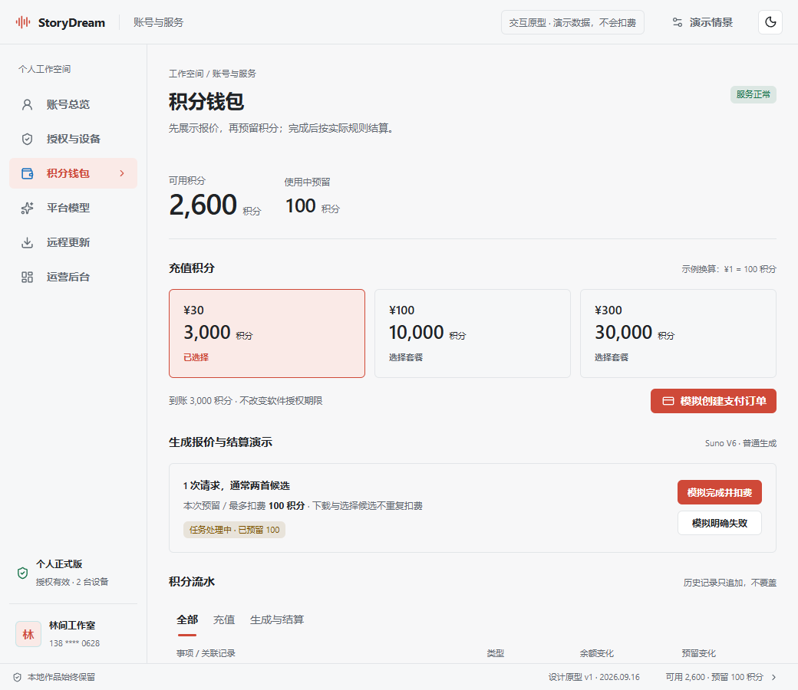

# StoryDream 账号、授权、积分与更新平台

本分支交付产品设计、接口与数据方案、可交互原型和分期实施计划。原型中的账号、价格、余额和支付结果均为明确标记的演示数据；尚未接入真实支付或发布更新。

基线已先行推送至 `origin/codex/shotcraft-motion-library`，提交 `bdf1f71964bdd1e7d31e40810dd2402250496c4a`。远程核对后创建本分支 `codex/account-credits-updates`。

## 查看方案

- [产品与商业规则](product-design.md)：用户流程、权限、积分计费和运营后台。
- [服务端与接口设计](backend-contract.md)：可信账号、账本、模型网关、支付与更新协议。
- [实施计划与验收](implementation-plan.md)：开发顺序、文件落点和上线要求。
- [交互原型](prototype/index.html)：运行现有 `npm run dev:web` 后，打开 `/docs/plans/account-credits-updates-2026-09-16/prototype/index.html`。使用现有 StoryDream UI 组件；不会调用真实 API。
- [验证记录](progress.md)。

启动开发服务后可直接打开 [本地交互原型](http://127.0.0.1:5173/docs/plans/account-credits-updates-2026-09-16/prototype/index.html)。六个页面共享演示状态：可以充值、兑换、解绑设备、切换模型来源，再查看钱包和更新等待行为。

## 复现原型验证

类型检查：`npx tsc -p docs/plans/account-credits-updates-2026-09-16/prototype/tsconfig.json --noEmit`。

浏览器检查：启动开发服务后，运行 `node docs/plans/account-credits-updates-2026-09-16/prototype/qa/verify.mjs`。需要可解析的 `playwright` 包及已安装的 Chrome；如使用工作区外提供的 Playwright，设置 `PROTOTYPE_NODE_PACKAGE` 为该依赖环境的 `package.json` 绝对路径。脚本阻止外部网络请求，仅操作本地 UI，并输出 [交互报告](prototype/qa/interaction-report.json) 与深浅主题截图。这些检查验证演示流程，不证明生产支付或账本已经实现。

## 核心方案

一个账号绑定软件授权、设备和积分钱包。软件激活决定可用功能；积分用于平台模型调用。系统设置中的每类模型保留多配置，新增“平台模型 / 自有 API”两种来源，平台密钥只留服务端。

用户在生成前看到预计积分和最多扣费，后台预留额度。成功按实际用量结算，未执行或明确失败释放预留。所有充值、消费、退款都能从任务追到订单或请求。

软件更新和模型目录更新独立：模型、费率和推荐项可更新；安装包通过签名验证后，在任务安全停止或完成后升级。

## 尚待运营定价的参数

原型使用 `¥1 = 100 积分`、两台设备、三档充值示例和 Suno 普通生成 `100 积分/请求` 来说明流程。它们是可调整的设计建议，不能直接当作正式售价。上线前需确定销售主体、支付商户、生产域名、代码签名、套餐权益和退款条款。
