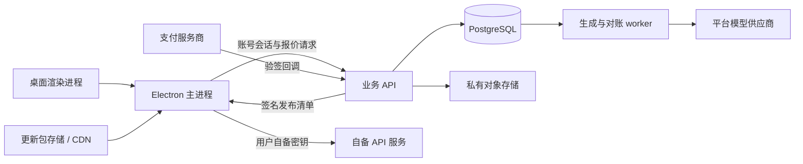
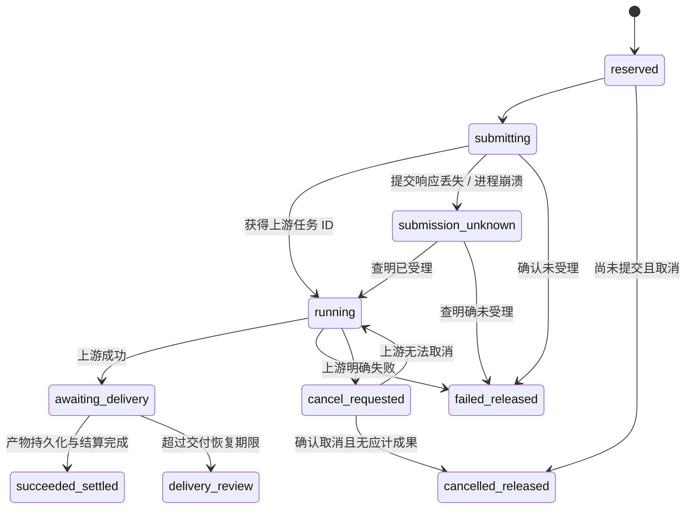

# 账号、授权、模型积分与更新：服务端协议设计

日期：2026-09-16。状态：设计方案，尚未建立生产服务、商户或真实账本。本文中的价格、有效期和设备数是可调整的设计建议，不是已批准的商业规则。

## 1. 现有依据与改造边界

本地 `storybound_gap_findings.md` 记录了「试用用尽仍可继续旧任务」、生成前检查积分、账号与激活分入口；`storybound_e_reverse_audit_2026-06-24.md` 记录了 `license_verify`、`check_update`、`apply_update` 与远程更新入口。18 张图 × 0.08 积分的记录只能证明其历史计费行为，不能作为本产品的售价、授权或支付协议。

当前代码的 `AccountProfile.balance`、`ActivationState` 和 `CreditTransaction` 是本地模拟状态：`AccountPage` 保存完整资料，`ActivationPage` 可编辑计划与状态，SQLite 保存显示用交易。因此新商业服务不能信任这些字段，也不能把旧数据迁移成真实余额或正式授权。

可复用的基础有：`electron/config-service.ts` 的公开配置与秘密分离、`electron/credential-vault.ts` 的 OS 加密与原子写入、七类模型的多配置选择，以及任务运行器的供应商适配层。新增账号会话需要独立的凭据库类型，不能直接向只接受模型 `SecretId` 的现有库塞入令牌。

本设计只借鉴已观察到的产品行为，自建账号、支付、授权与更新协议；不调用参考产品的私有接口。

## 2. 部署与信任边界

推荐第一阶段采用 TypeScript 模块化单体：Fastify API + PostgreSQL + 独立 worker + 对象存储。API、worker 共用领域包和数据库，先用 PostgreSQL outbox/租约队列保证事务一致性；达到实际吞吐瓶颈后再接 Redis 队列，消息仍只作唤醒提示，数据库保持事实来源。



职责明确分开：

| 部件 | 持有的数据和职责 |
| --- | --- |
| 渲染进程 | 可公开的账号、授权、余额快照、模型目录、任务状态；不接触平台上游密钥与刷新令牌，已保存 BYOK 密钥仅返回是否配置 |
| Electron 主进程 | 登录与刷新、OS 加密会话、设备签名、BYOK 密钥、受控下载和更新安装 |
| 业务 API | 认证、授权、设备席位、报价、账本、订单、模型目录、更新检查 |
| worker | 上游提交/查询、产物保存、用量归一化、幂等结算、支付主动查询与对账 |
| 管理后台 | 商品与价格版本、模型渠道、退款/补偿、授权发放、灰度更新；所有变更有操作审计 |

平台上游凭据仅保存服务端秘密管理器，数据库存 `credentialRef`。平台目录不会下发上游 base URL、Key、服务商余额或任意请求代理配置。服务端适配器固定上游 origin、允许的路径和请求字段，回调地址也由服务端生成。BYOK 继续在 Electron 直连用户配置渠道，不进入积分网关，不把用户密钥上传平台。

环境至少区分 development、staging、production。各环境独立数据库、支付凭据、签名密钥与对象前缀，不能用测试商品给生产钱包加分。

## 3. 身份、会话与设备

### 3.1 账号与登录

第一期建议手机验证码登录/注册，共用一套 `users + identities`；邮箱作为绑定和恢复通道，第三方身份后续作为 identity adapter 接入。联系方式展示可编辑不等于绑定完成，改绑必须验证新号码或地址，并对原身份或已有有效会话进行再次认证。相同验证码不能跨用途使用。

- 验证码 challenge 绑定用途、规范化目标、有效期、尝试次数和申请来源；服务端仅保存摘要，按目标/IP/设备分别限速。
- 错误提示避免透露该联系方式是否已注册；登录验证码与解绑、退款等敏感操作的再次验证分开。
- access token 建议 10 分钟，仅保留主进程内存；refresh token 建议最长 30 天，OS 加密保存。
- 服务端只存 refresh token 摘要，刷新采用一次性旋转和 family 记录。已消费 token 再次使用且不属于同一次幂等重试时撤销该 family。
- 刷新请求带独立幂等键与设备证明；服务端短时保留该次加密响应，网络重试取回同一 successor，避免「已刷新但响应丢失」被误判为盗用。
- token 带用户、会话、设备、环境与 audience；所有商业请求从 token 推导 `userId`，不接受请求正文替换付款账号。
- 登出撤销当前会话；「退出所有设备」撤销全部 refresh family。账号冻结直接阻止平台新扣费与新提交。

浏览器 OAuth 若后续接入，必须使用系统浏览器 + PKCE/state + 受控回跳；不能把 OAuth 客户端秘密放进桌面安装包。

### 3.2 设备绑定与授权

设备身份以安装时生成的随机 `installationId` 和设备公钥为主，私钥放 OS 加密库。设备名、系统、应用版本用于管理界面；不把不可变硬件序列号作为唯一授权凭证。重装后可通过账号设备管理回收旧席位。

首次注册设备和敏感绑定请求使用服务端一次性 challenge，设备签名覆盖 challenge、用途、用户会话和请求摘要；challenge 短期有效且只能消费一次。知道 installationId 不能冒充设备，复制离线许可证到另一设备也不能产生对应私钥证明。

激活码为高熵随机兑换凭证，服务端保存带 pepper 的摘要和可展示尾号，记录批次、商品、可兑换次数、过期时间。首版固定 `limit = 1`，一张码只能兑换一次；多次兑换字段仅为后续结构预留，不对首版运营开放。兑换必须先登录；在一个数据库事务内锁定代码与账号授权，校验有效性、写兑换记录、发放 entitlement。唯一约束 `(codeId, redemptionOrdinal)` 防止并发超发；同一幂等请求重复返回同一结果。账户授权与「当前设备激活」分开：兑换成功但席位不足时，授权仍在账号内，用户可管理设备后继续绑定。

建议许可证区分 `trial / subscription / perpetual`，而非用现有 `local` 字段猜测永久授权。entitlement 保存功能集合、有效期、设备上限、更新权益区间与商业商品版本；赠送积分通过另一笔明确的账本交易发放。

试用配额由服务端 `trial_grants + trial_usages` 管理，按账号、政策版本和幂等操作 ID 去重，在接受新操作时原子占用；卸载或清空本地数据库不会重置服务器配额。已受理操作带不可变 grant 引用，可继续恢复；新的收费模型子操作仍必须有余额与授权。纯本地功能的离线限制只能由签名租约与客户端执行，不能宣称可像云端余额一样完全防绕过。

离线许可证是服务端签名的有限租约，含 `licenseId/userId/devicePublicKeyHash/entitlementVersion/features/issuedAt/notAfter/keyId`。建议每 24 小时在线续租、最长 72 小时离线宽限；数值可在政策版本中调整。公钥随客户端交付并支持签名轮换。时钟回拨、换设备、租约过期触发在线校验，不能只读可编辑的 SQLite 状态。

离线租约仅授权本地能力；平台扣积分始终要求在线服务端检查余额与权限。服务端无法瞬间撤销已离线的有效租约，撤销最长延迟就是租约剩余时间；这是明确的产品取舍。桌面本地防篡改不等于绝对防破解，真正的付费模型资源由服务端控制。

### 3.3 账号切换隔离

登录/登出/切换由主进程串行协调，生成新的 `accountEpoch`；旧请求的 UI 回包不得写入新账号快照。缓存和远程任务索引按 `userId` 命名空间保存，服务端始终检查所有权。

- 已提交远程任务继续归原账号；切换后不能查看、下载或操作其私有资源，重新登录原账号后恢复。
- 尚未提交的报价失效；未进入上游的预留可申请取消。已提交任务按真实结果结算，不以关窗口或登出作为退款依据。
- 本地作品可以继续在工作区可见，但远程账户字段、充值记录、余额、远程产物地址不能混在一起；作品与云端资源所有权分别记录。
- BYOK 配置保留本地，但新账号默认不自动继承另一个账号的密钥。旧「本地用户」配置先归访客本地空间，迁移到某账号须由用户明确选取配置。
- 旧模拟余额、试用记录、手写激活状态只保留为本地历史，不上传或合并进真实钱包。

## 4. 数据模型与约束

服务端 ID 统一 UUIDv7 或同等稳定字符串；时间使用 UTC `timestamptz`。金额 CNY 以整数分保存；积分以整数 `creditUnits` 保存，**1 积分 = 1,000 units**。数据库使用 `BIGINT`，JSON 使用十进制字符串，避免 JavaScript 超过安全整数或浮点四舍五入。页面最多显示三位积分小数。

| 表 | 核心字段与不可省略的约束 |
| --- | --- |
| `users` | id、status、displayName、createdAt；无可任意写入的余额列 |
| `identities` | userId、kind、normalizedIdentifier、verifiedAt；`(kind, normalizedIdentifier)` 唯一 |
| `auth_challenges` | purpose、targetHash、codeHash、expiresAt、attemptCount、consumedAt |
| `sessions` / `refresh_tokens` | userId、deviceId、familyId、digest、usedAt、revokedAt；digest 唯一 |
| `devices` / `device_bindings` | userId、installationId、公钥、label、lastSeenAt；绑定席位在事务内检查 |
| `license_products` / `entitlements` | 商品政策版本、功能、期限、更新权利、deviceLimit、status |
| `trial_grants` / `trial_usages` | userId、政策版本、quota、used、operationId；同一试用操作唯一，锁 grant 后原子占用 |
| `activation_codes` / `redemptions` | codeHash、productVersion、limit、expiresAt；幂等兑换和唯一用量序号 |
| `wallets` | userId 唯一、availableUnits、reservedUnits、frozenUnits、version；非负检查；只是账本投影 |
| `ledger_transactions` | id、kind、businessKey 唯一、referenceType/referenceId、createdAt、reversalOf |
| `ledger_postings` | transactionId、accountId、signedUnits；同交易所有分录求和为 0 |
| `credit_lots` / `lot_allocations` | 来源充值/赠送、原始 units、剩余/预留/冻结 units、消费分配；支持退款追溯 |
| `recharge_products` / `recharge_orders` | 商品不可变版本、amountFen、paidUnits、bonusUnits、currency、userId、status |
| `payment_attempts` / `payment_events` | orderId、provider、merchantOrderNo、providerTradeId、eventId、verifiedAt；商户订单号/服务商交易号在渠道内唯一 |
| `refunds` | orderId、amountFen、unitsToRevoke、status、providerRefundId、frozenLotSnapshot |
| `model_catalog_versions` / `model_entries` | capability、publicModelId、adapterVersion、capabilitySchema、publishedAt、可用状态 |
| `provider_routes` / `provider_credentials` | 固定 origin、适配器、credentialRef、渠道健康；不向客户端公开 |
| `rate_versions` | 单位、计量/取整规则、价格、失败/部分成功政策、有效时间；发布后不可修改 |
| `quotes` | userId、inputHash、model/rate/route 版本、reservedUnits、expiresAt、singleUseJobId |
| `generation_jobs` / `job_attempts` | ownerId、capability、clientOperationId、quoteId、state、upstreamId、submissionKey、snapshotHash、lease |
| `usage_records` | jobId/attemptId、上游原始用量摘要、归一化数量、计量版本、settledUnits |
| `artifacts` | ownerId、jobId、私有 objectKey、sha256、size、mime、retentionUntil、status |
| `outbox_events` / `idempotency_requests` | 消费租约、重试时间；scope/key 唯一，请求摘要冲突返回 409 |
| `audit_events` / `reconciliation_runs` | actor、动作、对象、变更摘要、原因、关联流水；敏感值脱敏 |
| `release_manifests` | platform/arch/channel、version、build、签名对象、最低版本策略、灰度规则、发布时间 |

钱包每次变更必须在同一事务中锁定钱包行，创建完整分录、更新钱包和 lot 投影、写 outbox。仅允许指定账本数据库函数写入分录，并通过延迟约束触发器在事务提交前检查每笔平衡；业务角色不能直接 UPDATE/DELETE 已入账分录。修正错误只能添加反向分录和新交易。

所有资源查询必须限制 `ownerId = authenticatedUserId`；管理员接口独立权限与审计。私有产物只通过短时签名下载地址发放，不能把永久公开上游 URL 当访问控制。

## 5. 模型目录与运行路径

七类能力统一进入 `ModelCapability = text | image | video | music | tts | speechToText | vision`。平台目录以稳定公开模型 ID 为选择值，展示名称、能力参数、推荐用途、最大输入/时长/并发、收费方式和当前版本。音乐的生成、续写、翻唱、分轨、克隆等是独立 operation，不能把所有高级操作都按一次普通生歌计费。

每个能力允许独立选择：

```ts
type ModelSelection =
  | { mode: 'platform'; modelId: string; catalogVersion: string }
  | { mode: 'byok'; localProfileId: string };
```

平台目录默认值由服务端发布；用户可以保存多个平台选项或 BYOK 配置，单独选择启用项。目录刷新只更新可选信息，不偷偷更换用户当前模型、覆盖 BYOK 参数或改变运行中任务。已下架模型保留历史可读，在下一次提交前要求重新选择；紧急停用可阻止未提交作业。

运行任务在提交时冻结模型、能力、参数、价格和路由版本。改变当前启用配置不影响在途任务。供应商迁移与价格调节发布新版本；备用渠道仅在仍符合已确认价格上限和能力契约时使用，且提交结果未知时绝不改路由重试。

## 6. 报价、预留与结算

建议充值兑换关系为 **1 元 = 100 积分**，只是展示设计参数。真正价格以商品/费率版本为准，不能依据用户端参数或上游即时返回随意扣分。成本、毛利与面向用户的售价分开保存，调价不回溯已确认报价。

| 能力 | 建议计量基础 | 上限与结算依据 |
| --- | --- | --- |
| 文本 / 视觉 | 输入、缓存输入、输出 token；视觉另含明确图片/视频单位 | 完整输入估算 + 强制最大输出；服务端记录的可信 usage |
| 图片 | 每张或每请求 × 尺寸/质量档 | 按张模型按成功交付数；按请求模型使用明确的最低成功条件和请求价，单价与取整规则在 rate 中 |
| 视频 | 生成秒数 × 分辨率/模型/音频档 | 限定秒数，使用上游确认和服务端媒体探测 |
| 音乐 | operation/次数/成套歌曲/下载处理 | 每个操作单独定义；一单两首等必须明确计费单位 |
| 配音 | 字符数或生成时长 | 标点/Unicode 统计规则固定版本，时长由服务端媒体探测 |
| 语音转文字 | 输入音频计费秒数 | 已上传文件探测并按规则向上取整，不能信任客户端声称时长 |

步骤：

1. 上传并验证必要素材，服务端计算输入摘要、媒体时长和参数合法性。
2. `POST /quotes` 返回价格明细、预留上限、费率版本、有效期。建议有效期 5 分钟；报价本身不冻结积分。
3. `POST /jobs` 带 quoteId 和幂等键，事务内校验用户、权限、报价未过期、输入摘要一致、余额充足；预留上限并创建 job + outbox。任意一步失败都不提交到上游。
4. worker 执行；完成后归一化 usage，先把产物可靠写入私有对象存储，再按报价版本结算并释放余款。
5. 客户端收到失败、取消或超时后先查询同一 job，不能自动重新生成。下载失败可重试下载已交付产物，不再扣生成积分。

上传接口限定内容用途、总大小、数量和有效期，完成后由服务端校验真实 MIME、摘要与媒体参数。平台任务只引用已验证且属于自己的 assetId，不接受任意网络 URL 让 worker 代取内网资源；需要导入远程素材时走单独受控导入适配器。

预留不足不得擅自透支。可变输出必须设置可以计算的硬上限；确需更多额度时停止未开始的后续步骤并发起新报价，经用户确认后继续。平台内部故障、额外内部重试或成本误算不自动转嫁给用户。

流水例子：预留 12 积分，成功实际消费 9 积分。

| 交易 | 分录（单位：units） | 用户可见结果 |
| --- | --- | --- |
| reserve | 用户 available −12,000；用户 reserved +12,000 | 预留 12，尚未最终扣费 |
| settle | 用户 reserved −12,000；平台 consumed +9,000；用户 available +3,000 | 消费 9，释放 3 |
| release（完全失败的替代路径） | 用户 reserved −12,000；用户 available +12,000 | 全额释放预留 |

充值到账则为平台 issued −N、用户 available +N，赠送积分独立 lot。系统发行/消费分录是积分账本对手方，不代表法定会计科目；真实资金账务与积分账务独立对账。

复合视频/文章任务分解为可计费 child jobs，父任务展示总预算、已用和预留。可先预留已知总上限并为子步骤分配额度，或逐步确认报价；不能把尚未知道数量的后续生成伪装为固定总价。成功子结果计费、失败子结果释放，重跑已有成功步骤会产生明确的新报价与新记录；旧作品查看和本地重组不收费。

## 7. 生成任务状态机与故障处理



`submission_unknown` 不能因为租约到期就重新 POST。每次外呼先写 attempt 和稳定 submissionKey；有上游幂等能力时重放同键，有查询能力时按业务引用查询，没有能力时进入人工核查并保留预留，直到有证据可判定。超过服务承诺可由平台先补偿/释放用户预留，记录平台承担成本的决策；稍后发现上游成功也不再次扣用户积分。

`delivery_review` 优先恢复下载/对象写入；确实无法交付时按公开政策释放或补偿。迟到结果归档为原 job 的产物，不重新结算已终结退款的账单。

worker 使用行锁和租约拿工作，但租约不意味着独占的外部副作用；幂等提交键、唯一 `settlement:<jobId>` / `release:<jobId>` 和 job 状态版本共同防重。终态结算与释放互斥；部分成功统一在一笔 settlement 中决定实扣与释放，不各跑一套相互冲突的事件。

上游 webhook 要验签/来源契约，记录 providerEventId；允许重复、乱序与迟到事件，按状态转换规则处理。没有可靠验签能力的回调只触发主动查询，不直接认定成功或扣分。服务商使用量可能延迟，用户报价已确定的固定价操作无需等待上游资金账单才能交付。

## 8. 充值、退款与对账

### 8.1 充值订单

客户端只提交 `productId + productVersion + channel`，服务端按已发布商品创建金额和积分快照。二维码/支付 URL 通过所选服务商的正式 SDK 或协议生成，不允许客户端传入应付金额、应得积分或回调目标。

订单状态：`created → payment_pending → paid → credited`；未付款可进入 `expired/closed`。支付状态与入账状态分离，便于处理「支付已成功、账本事务暂时失败」。失效二维码不是商户已退款证明：已过期订单收到合法延迟支付通知时先主动查单，核实金额、币种、商户、交易号和归属后正常入账，或按明确政策进入退款；不得直接丢弃到账款。

回调处理顺序：原始消息限长读取 → 验签/解密/时间窗检查 → 订单字段核对 → 保存唯一事件 → 锁订单 → 以 `recharge:<orderId>` 唯一业务键发行积分 → 更新 credited → 写 outbox → 提交事务 → 回复成功。重复通知返回同一成功结果；服务商交易号不能绑定两个本地订单。对无法验签或金额不符的事件拒绝入账并产生审计告警。

「支付成功」浏览器跳转或客户端截图不作为入账依据。客户端轮询自己的订单状态；支付页面关闭后仍可从订单列表恢复。客户端超时不能自动新建另一个相同待付订单。

### 8.2 退款和冻结

充值积分按来源 lot 分配消费，付费和赠送分开；一期建议只开放符合规则的未消费充值退款，部分退款也必须按商品快照计算。已消费、已预留或已被其他退款冻结的 units 不能重复退。

流程：`requested → funds_frozen → provider_pending → refunded`，失败可转 `rejected/released`。开始退款时锁订单、钱包和相关 lot，把可退款 units 从 available 转 frozen，阻止用户同时花掉；确认真实资金退款后在账本撤回 frozen units 与相关未消费赠送。明确退款失败才释放冻结。请求超时处于 `provider_pending/unknown`，查单后再决定，不盲目重复退款。

一笔充值的累计退款分不得超过原 paidFen；服务商退款单号和 `refund:<refundId>` 分录唯一。部分退款取整规则与最终一笔余数分配固定在商品版本中。争议拒付涉及已消费积分时，账户可被限制平台新消费，财务追偿或平台损失另记，不伪造一笔负可用余额破坏钱包非负约束。

### 8.3 对账和修复

- 近实时恢复：扫描 paid 未 credited、超时 payment_pending、unknown refund、提交未知任务、长时间预留。
- 每日支付对账：服务商账单与订单逐项核对金额、费用、支付/退款状态；差异进入工单，不能只比较总额。
- 每日积分钱包对账：全量或增量重算 postings 与 wallet/lot 投影，检查每笔分录平衡、无双结算、预留可追溯。
- 每日模型成本对账：provider requestId / job / usage 与服务商账单对应，确认重复成本、遗漏用量和费率误差；不修改用户已完成报价。
- 修复通过经审计的补偿交易，包含原因、证据引用、操作者；高额人工充值/退款建议双人复核。不可直接编辑余额。

## 9. HTTP 与桌面 IPC 契约

HTTP 根路径为 `/v1`，真实域名待部署时选定。标准错误 `{ error: { code, message, retryable, requestId, details? } }`，错误不回传上游完整请求、凭据或其他用户信息。金额与积分字段均为整数十进制字符串。写请求使用 `Idempotency-Key`，按用户 + route + key 唯一；相同键不同规范化 body 返回 `409 IDEMPOTENCY_CONFLICT`。关键业务 ID 的唯一约束长期保留，不能随短期请求缓存过期消失。

| 方法与路径 | 输入要点 | 结果 / 权限 |
| --- | --- | --- |
| `POST /auth/challenges` | channel、target、purpose | challengeId、expiresAt、retryAfter；限速 |
| `POST /auth/verify` | challengeId、code、设备公钥/证明 | 主进程接收会话；渲染进程仅拿公开登录结果 |
| `POST /devices/challenges` | 已认证会话、用途、installationId | 一次性 nonce/challengeId，用于绑定或设备证明 |
| `POST /auth/refresh` | refreshToken、deviceProof | 旋转后的会话；同次网络重试幂等 |
| `POST /auth/logout` | 当前会话；可选明确 allSessions | 撤销结果 |
| `GET /me` / `PATCH /me` | PATCH 仅 displayName/avatar 等白名单 | 用户资料；不允许改余额、身份验证或授权 |
| `GET /me/sessions` / `DELETE /me/sessions/:id` | 会话所有权 | 会话管理；敏感操作再次认证 |
| `GET /me/devices` / `DELETE /me/devices/:id/binding` | 自己的设备 | 解绑席位，撤销该设备的会话、刷新令牌和租约续期；在线权限检查立即拒绝其新云调用，已提交任务继续 |
| `POST /licenses/redeem` | activationCode | 账号 entitlement；不直接写本地 active |
| `POST /licenses/bind-device` | entitlementId、deviceProof | 已签名离线租约、服务端权益快照 |
| `POST /licenses/renew-lease` | deviceProof、当前 entitlement 版本 | 新租约或明确失效原因 |
| `GET /wallet` | 当前账号 | available/reserved/frozen units、revision、serverTime |
| `GET /wallet/transactions` | cursor、kind、date range | 用户可读流水；关联 job/order，无内部秘密 |
| `GET /recharge/products` | 环境与可用渠道 | 当前商品版本及真实应付金额 |
| `POST /recharge/orders` | productId、version、channel | orderId、paymentAction、expiresAt |
| `GET /recharge/orders/:id` | 所有权检查 | 支付与入账分别展示 |
| `POST /recharge/orders/:id/refunds` | 明确退款范围与原因 | refundId、状态、冻结明细 |
| `POST /payments/:provider/webhook` | 服务商签名 payload | 服务端验签；无需终端登录，不相信正文 userId |
| `GET /models/catalog` | platform、appVersion；If-None-Match | capability、默认项、参数、feeSummary、版本 |
| `POST /assets/uploads` / `POST /assets/:id/complete` | 用途、声明大小/mime/hash | 限时上传凭据；完成后服务端验证与探测 |
| `POST /quotes` | capability、operation、modelId、params、assetIds | quoteId、rateVersion、items、reservedUnits、expiresAt |
| `POST /jobs` | quoteId、inputHash、clientOperationId | jobId、reservedUnits、snapshotVersion |
| `GET /jobs/:id` / `GET /jobs` | owner + cursor | 状态、用量、实扣/释放、产物列表 |
| `POST /jobs/:id/cancel` | 当前 owner | 取消申请结果；不承诺已受理上游立即退款 |
| `POST /artifacts/:id/download` | owner | 短时下载 URL、校验和、大小 |
| `GET /updates/check` | appVersion、platform、arch、channel、安装 cohort | 签名 manifest 或无更新；详见更新专章 |

报价示例中的数值只是协议演示：

```json
{
  "quoteId": "quote_example",
  "modelId": "platform.image.standard",
  "catalogVersion": "catalog_example_1",
  "rateVersion": "rate_example_1",
  "inputHash": "sha256:example",
  "items": [{ "operation": "image.generate", "quantity": "3", "unit": "image", "creditUnits": "12000" }],
  "reservedUnits": "12000",
  "expiresAt": "2026-09-16T12:05:00Z"
}
```

桌面新增 IPC 不暴露泛用 authenticated fetch。主进程提供 `account.login/refresh/logout`、`license.redeem/bind/refresh`、`wallet.get/listTransactions`、`recharge.create/get`、`platformModels.catalog/quote/submit/get/cancel`、`updates.check/download/install` 等固定契约。renderer 输入使用 Zod 校验，主进程检查可信窗口；响应经过公开投影。`account:save` 改为仅允许资料白名单，`activation:save` 不再作为商业授权入口；迁移期旧模拟编辑功能只能存在于明确的开发预览。

错误码至少包括 `AUTH_REQUIRED`、`SESSION_REVOKED`、`ACCOUNT_RESTRICTED`、`LICENSE_REQUIRED`、`DEVICE_LIMIT_REACHED`、`LEASE_EXPIRED`、`INSUFFICIENT_CREDITS`、`QUOTE_EXPIRED`、`QUOTE_INPUT_CHANGED`、`MODEL_UNAVAILABLE`、`IDEMPOTENCY_CONFLICT`、`SUBMISSION_UNKNOWN`、`PAYMENT_PENDING`、`UPDATE_INCOMPATIBLE`。余额不足是可恢复的暂停原因，不把已完成本地产物删除。

## 10. 更新服务的后端边界

检查更新、下载更新与安装更新分开。更新清单至少含 platform、arch、channel、version/build、minSupportedAppVersion、releaseNotes、文件大小、SHA-256、下载地址、manifest schema、签名/keyId、发布时间和 rollout 条件。签名覆盖完整不可变清单；下载包还需要平台代码签名，不能仅依赖 HTTPS 和文件哈希。

发布服务使用独立签名职责：普通后台编辑发布说明不应获得签名私钥；签名制品经 CI 验证后发布。灰度 cohort 可从安装 ID 单向计算，保持相同设备分组稳定，不需要公开硬件标识。撤回版本会停止新分发；客户端已下载包在安装前重新核验是否被撤回。

授权与更新资格分开表达：安全修复可作为所有用户可用，功能大版本是否在授权内由明确商品政策决定。最低版本阻断最多阻断不兼容的在线请求，并提示升级，不锁住用户本地作品读取、导出和备份。正在生成或导出时延后安装；数据库迁移、回滚边界与签名轮换交由客户端更新设计细化。

## 11. 必须通过的验收场景

1. 两个并发任务总预留超过余额，只能有可负担的一组成功，余额与 lot 均不为负。
2. 同一 quote / clientOperationId 被双击、重试或两个进程提交，只创建一个 job、一笔预留和至多一笔结算。
3. worker 在发出上游请求后立刻崩溃，恢复后查询原请求，不无条件再次付费提交。
4. 结算与取消回调并发，最终只走一种资金终态；每笔分录和投影一致。
5. 部分图片成功，按张合同只扣成功交付数；按请求合同按预先公布的成功条件处理，不临时换单位；重新下载不扣分。
6. 充值通知重复、乱序、延迟或服务重启，只入账一次；签名/金额/币种不符不入账。
7. 支付成功但入账事务故障，主动对账能恢复；客户端「成功跳转」不能自行加分。
8. 退款冻结与生成预留并发，已冻结积分不可消费；退款超时保留待查状态。
9. 切换账号时迟到的余额、订单、任务与产物请求不会污染新账号，也不能通过换 ID 越权读取。
10. 客户端修改本地 balance、activation、deviceId 或 quote 金额，不能增加服务端权益或跳过扣费。
11. 目录调价、启用另一模型、切换渠道后，在途任务仍按原快照路由和结算。
12. 离线租约过期、设备解绑、服务器不可达时，本地作品仍可读，付费平台新调用不会离线扣分。
13. 上游成功而存储下载失败，恢复交付不重生；不可交付最终按政策补偿，不扣两次。
14. 账本投影被模拟损坏时，对账能定位差异并从不可变分录重建，不改写历史。

## 12. 实施前仍需选择的外部资源

实际账号验证渠道、后端域名/运行环境、数据库与对象存储、支付商户与退款能力、代码签名证书、首批平台模型供应商，以及正式商品价格尚未指定。开发阶段采用合约测试与明确标记的沙箱适配器；不把假支付、模拟积分、样例价格或测试激活码作为可对外收费功能上线。
