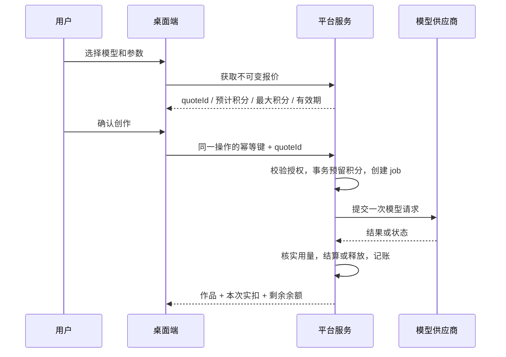

# 产品设计

## 1. 定位与参考依据

这套功能作为现有创作软件的运营基础，覆盖账号登录、软件激活、设备绑定、官方默认模型、积分钱包、充值、调用计费、软件更新和运营后台。

参考本地既有 Storybound 学习材料，而非重新调用其商业服务：

| 既有证据 | 采用的产品行为 | StoryDream 的设计 |
|---|---|---|
| `storybound_gap_findings.md:43`，18 张图需 1.44 积分而余额不足 | 调用前明确判断积分是否足够 | 全部七类模型统一报价、预留、结算 |
| 同文件 `:47`，试用耗尽后旧任务仍可继续 | 保留用户已完成资产与旧任务入口 | 查看、编辑已有文件、下载已有结果不被充值弹窗锁住；新的云模型调用仍需余额和权限 |
| 同文件 `:48–50`，账号/激活入口及积分状态 | 权益与钱包可随时查看 | 一个账号中心，授权、钱包、设备分区；状态入口保留 |
| `storybound_e_reverse_audit_2026-06-24.md:146–161`，license/update 命令 | 授权与更新由宿主管理 | Electron 主进程控制凭据与更新，服务端控制授权和账目 |

这些是历史观察，不能据此推断参考软件当前售价或后台实现。采用其使用流程，开发自己的账号、支付、账本与更新服务。

## 2. 一套账号，三种独立状态

| 状态 | 回答的问题 | 数据所有者 |
|---|---|---|
| 登录与设备 | 谁在什么设备上使用？ | 账号服务 |
| 软件授权 | 当前账号允许使用哪些功能、到什么时候？ | 权益服务 |
| 积分钱包 | 还能调用多少平台模型？ | 服务端账本 |

买软件授权不自动代表无限模型调用。充值积分也不自动延长软件授权，除非购买的商品明确同时包含权益。购买页分别列出“授权期限、可用设备、到账积分”。

首版个人账号即可；数据库预留组织/工作区归属，但团队共享积分不在首发范围。显示名称和联系方式能编辑；余额、计划、到期时间、设备上限只能从服务端读取。

## 3. 登录、绑定和退出

首版采用手机验证码登录/注册，邮箱绑定用于账户恢复和通知；后续再接微信扫码，避免首版同时维护多套账号标识。发送验证码有倒计时、频率限制、失败提示；日志不记录验证码。已登录账号绑定其他标识时验证原身份，新标识冲突时给出账号合并申请入口，禁止仅凭相同昵称自动合并。

登录成功后绑定本机设备，同步权益、余额、模型目录。刷新令牌存入 Electron 加密凭据库，渲染层只获得脱敏账号和状态。设备 ID 使用随机安装 ID 和设备公钥，硬件信息只辅助识别，重装恢复需要重新验证。已有本地自有 API 配置无需重新录入；首次登录时由用户选择关联哪些配置，新账号不自动继承其他账号的密钥。

退出登录先提示当前任务：已经提交到云端的任务继续按原账号结算，保留可查询记录；排队未提交任务暂停，之后要以新账号重新报价，不能扣到另一个账号。退出后不删除本地作品或自有 API 配置。切换账号不把原账号的余额、云作品下载权限或预留额度带到新账号。

## 4. 激活与权益

推荐商品结构：基础试用、个人正式授权、积分充值包。月度/年度或永久授权由运营配置，首版暂不实现自动续费。试用时长、试用积分和功能清单均为后台策略；赠送额度使用独立积分批次，防止与付费余额混淆。

激活码是授权商品的兑换凭证，可由销售、活动或后台批量发放。用户必须先登录，再输入兑换码；确认页显示授权期限、设备数、附带积分和是否叠加。激活码只兑付一次，在服务端原子写入；网络重试返回原兑换结果。码本身仅以不可逆摘要存储，展示只保留末四位。

建议默认同时绑定两台设备，试用一台；这是运营可调参数。设备列表显示名称、系统、最近在线和“当前设备”。达到上限先选择解绑旧设备，再绑定新设备；本机解绑前确认。解绑撤销该设备刷新令牌和新云请求权限，已经付费提交的工作由服务端完成。

离线使用有效签名的授权租约，建议宽限 72 小时。离线可编辑、播放、导出已有本地素材；平台模型不提供离线扣费。到期后显示“联网校验授权”，不删除文件。电脑时间回拨不延长租约；涉及积分和试用配额的决定必须在线。

| 使用场景 | 未登录 / 无授权 | 有效试用或正式授权 | 授权到期 / 离线宽限后 |
|---|---|---|---|
| 查看已有作品、播放下载好的音频 | 可用 | 可用 | 可用 |
| 导出已有素材与项目备份 | 可用 | 可用 | 可用 |
| 准备新草稿、修改文字 | 可用 | 可用 | 可用 |
| 启动新的完整创作流程 | 提示登录/激活 | 按权益 | 暂停并保留草稿 |
| 平台云模型 | 登录、权益、余额均满足后 | 报价后调用 | 不提交新调用 |
| 自有 API | 按软件功能权益 | 使用本机凭据，不扣平台积分 | 可设置 BYOK 专属授权权益 |
| 已在云端提交的任务 | 原账号查询完成结果 | 继续 | 服务端继续结算，结果保留 |

“旧任务可继续”指结果可取回和有权限的剩余步骤继续，不意味着绕过模型付费或无限重复生成。

## 5. 平台默认模型与现有多配置

七类能力统一支持：文本、绘图、视频、音乐、TTS、语音识别、视觉分析。

设置列表每条配置显示来源标识。平台模型显示名称、能力、积分单价、状态和推荐标志；自有 API 显示已有本地配置。每类仍可保存多套、编辑备用项、明确启用一项。

平台配置只包含 `modelId`、允许的生成参数与目录版本，不包含供应商 API Key、内部地址或真实采购成本。平台后台保管密钥、供应商路由和利润规则。用户当前登记的个人渠道不会自动上传成为全体用户共用密钥，运营接入时单独配置服务端凭据。

新账号安装后可直接选择推荐平台模型；已有用户升级保留原启用项及所有自有 API，不静默改为扣积分模式。用户主动切换来源时清晰提示“本次由平台积分计费 / 费用由你的 API 服务商收取”。平台模型失败后不得偷偷用用户私有 key；自有 API 失败也不自动扣平台积分。

后台可以更新推荐模型，但不能替用户切换已固定的模型。旧模型停用时提示替代模型及新价格；已经提交的工作继续使用原模型与报价版本。自动降级仅在用户事先授权的模型集合和积分上限内进行，同一用户操作不会因为网关重试而再次收费。

## 6. 积分与费率

建议用统一积分钱包，充值换算示例为 `¥1 = 100 积分`，内部以整数 milli-credit 保存，`1 积分 = 1000 milli-credit`，不使用浮点数做财务运算。金额以分保存；付费积分、赠送积分及预留分别可查。

运营费率是版本化的零售价，不在用户调用时按波动的供应商报价临时加价。成本可以建议售价：`售价积分 = 采购人民币成本 ÷ (1 - 目标毛利率) × 每元积分数`，再按商品粒度取整。美元成本使用该费率版本冻结的汇率；毛利测算额外计入支付费率、失败损耗、存储和带宽。发布前做成本与毛利预览。

| 能力 | 推荐计价单位 | 必须计入报价的参数 |
|---|---|---|
| 文本 / 视觉 | 输入与输出 token 分别计价 | 缓存、图片输入、推理 token、输出上限；供应商没有可信 usage 时使用事先公布的固定请求价 |
| 绘图 | 张 / 次 | 尺寸、质量、编辑模式、候选数量；供应商按请求付费时必须显示“每请求” |
| 视频 | 秒或固定请求 | 分辨率、时长、音频、首尾帧等 |
| TTS | 字符或音频秒 | 音色、克隆、模型与语言；字符计算方法由对应模型适配器定义 |
| 语音识别 | 输入音频秒 | 服务端读取真实时长，不相信客户端报数 |
| 音乐 | 请求 / 操作 | V6 版本、Max、强化上传、分轨、辅助次数等，各操作独立 SKU |

示例：Suno 普通生成展示“100 积分 / 次，通常两首候选”；Max 示例 200 积分。供应商普通生成成本资料为 ¥0.60/次，仅用于设计示例，正式开售前重新验证。一次普通生成只因返回两首歌而扣一笔请求价；选择其中一首、再次下载不会二次收费。

任务开始前：显示本次预估、最多扣费、当前可用、模型来源和是否包含已完成步骤。流水线按阶段报价和预留，不在整篇未知输出时假装精确总价。达到任务预算上限暂停，保留结果；提额要用户明确操作。

计费流程：

| 情况 | 用户账目与页面表现 |
|---|---|
| 余额不足 | 提交前拦截，显示差额；充值返回后重新确认报价，绝不自动再次生成 |
| 供应商明确失败、未产出 | 释放预留，用户不扣费；供应商成本损失由平台承担并单独记录 |
| 提交超时，不清楚是否受理 | 标记“核对中”，查询原请求，不盲目重新提交；最长核对时限后台配置，超限由平台承担不确定成本并释放用户预留 |
| 批量部分成功 | 按报价合同逐项结算；请求计价模型只要符合已披露的最低成功条件即按请求价，否则人工补偿；不自行把请求价平摊为张价 |
| 取消 | 未派发立即释放；已派发显示“正在尝试取消”；上游无法取消且成功完成，按提交前说明结算 |
| 客户端关机 / 掉线 | 服务端继续处理，重开查询同一 job；不创建新收费请求 |
| 上游失败后自动重试 | 同一个逻辑作业只收一次零售价，额外供应商成本由平台承担；未知受理状态不自动重试 |
| 用户点击重新生成 | 创建新的操作与报价，清楚显示新扣费 |

## 7. 充值、订单、退款与流水

充值页建议固定套餐示例：¥30/3000 积分、¥100/10000 积分、¥300/30000 积分；首版不默认赠送，赠送作为独立可配置活动。未支付不锁定价格很久，订单附带套餐版本和失效时间。

流程：选择套餐 → 确认付款金额及到账积分 → 创建订单 → 微信/支付宝官方收银台或扫码支付 → 服务端验签确认 → 钱包到账 → 返回原工作。原型按钮“模拟到账”只用于查看设计，生产不存在客户端自行宣布付款成功的入口。

支付关闭不等于支付失败。二维码过期后到账、回调晚到、重复回调、用户关闭窗口都由服务端查询和唯一交易号处理；一个订单只入账一次。支付金额、币种、商户号和订单归属必须一致。

流水标签：充值、赠送、预留、结算、释放、退款、人工调整。展示发生时间、任务/模型、积分变化、预留变化、订单号和状态，支持按日期和任务筛选。账户主数字为“可用积分”，旁边显示“使用中预留”。

退款进入原支付渠道，按未消耗的付费积分批次处理，先锁定可退余额，已消费或已预留部分不可同时退；赠送积分根据公开活动规则撤回。付款退款和积分冲正具有独立状态，后台对账补偿失败步骤。异常拒付导致不足时冻结新付费调用并进入人工核对，不在用户历史文件上实施删除或锁定。

## 8. 用户页面

- 全局右下角：可用积分、预留积分；点击进入钱包。顶部可显示试用剩余天数或授权到期提醒。
- 账号中心：登录身份、授权概览、钱包概览、设备列表、账号安全、退出登录。
- 激活与授权：当前计划、到期时间、设备数、兑换码、授权订单；状态只读。
- 积分钱包：可用/预留、充值、订单、流水；充值中显示可关闭提示。
- 系统设置 → 各模型：平台/自有 API 配置列表、单价、明确启用、费用说明。
- 生成确认：模型、参数、报价、最多扣费、余额不足路径；明确重试与重新生成差别。
- 关于与更新：当前版本、发布通道、更新日志、检查/下载/稍后安装、失败重试。

视觉延续现有 Fluent 组件、珊瑚红强调色、双主题和紧凑桌面布局；不会在创作工作区塞入营销弹窗。

## 9. 远程更新

模型目录/计费规则、公告、功能开关走受约束配置协议。客户端只接受已知字段，不执行远端脚本、任意命令或远程 JSX。缓存需有签名、版本、到期策略；旧报价在有效期内按原价履约。

软件二进制更新走独立发布通道 `stable / beta`。检查更新无需登录，下载只接受发布白名单地址与签名；校验失败不安装。展示更新日志、包大小、最低支持版本和是否需要重启。

下载可在后台完成；安装前必须确认没有生成提交、素材写入、渲染和导出活动。提供“任务完成后安装”“稍后提醒”“保存并重启”。新版本启动完成健康检查后才标记成功；升级前做数据库可恢复备份，失败回滚必须保证数据库版本兼容。不能让旧程序直接打开不可逆升级后的数据库。

升级首启在迁移和健康检查完成前不开放用户编辑，避免回滚时丢失新写入。优先使用可向后兼容的增量迁移；不可逆迁移明确标记恢复边界。回退使用备份副本恢复到独立目录，保留失败版本数据供修复，不直接覆盖用户唯一数据库。更新 manifest 同时声明可兼容的数据库范围、可回退版本和最低服务端协议版本。

当前发行物是 portable ZIP，没有成熟自动更新器。首版先提供签名完整安装包和手动安装，随后迁移至支持 updater 的 Windows NSIS 安装版；便携版保留完整包下载和显式数据目录迁移。未配置证书前不显示“签名已验证”。

严重漏洞可提示最低支持版本并禁止新的平台调用，但用户仍可打开本地作品和导出。不能在任务中强杀进程完成强制升级。

## 10. 运营后台

| 页面 | 日常操作 | 关键限制 |
|---|---|---|
| 用户与设备 | 搜索用户、暂停云调用、解绑设备、查看权益 | 客服不能直接改余额 |
| 授权商品 / 激活码 | 配置期限、设备数、生成批次、撤销未兑换码 | 展示发放/兑换审计，不能复用已兑换码 |
| 充值订单 | 支付状态、补查、退款申请 | 验证支付平台事实，人工操作不伪造支付回调 |
| 积分账本 | 查询、审计、补偿、导出 | 追加更正记录；禁止修改历史行 |
| 模型目录 | 七类模型、多渠道、推荐、暂停、参数限制 | 平台密钥只在服务端，测试请求明确成本 |
| 价格版本 | 草稿、成本测算、审核、定时发布 | 已接受报价绑定旧版本，不能追溯加价 |
| 版本发布 | 上传构建、签名校验、beta、灰度、全量、撤回 | 撤回停止新下载，不强制降级运行中的客户端 |
| 运行与对账 | 卡住作业、未知请求、冻结超时、支付差异 | 补偿有原因、操作者、关联原记录 |

管理员使用独立身份体系和 MFA；运营、客服、财务、发布管理员分权。调整积分、退款、改价格、发布版本均产生审计；高金额调整和正式发布建议二次复核。

## 11. 首发建议与未决项

建议首发先上线“账号 + 激活 + 钱包 + 一条平台模型链路（Suno）+ 一个支付渠道 + 手动安全更新”，把幂等、对账和任务恢复验收后，按相同计费网关扩展其余六类。原型展示最终全套结构，实施按阶段推进。

上线前确定：支付商户与收款主体、服务域名和托管区域、签名证书、授权售价与期限、充值换算和活动、模型零售价及供应商数据条款、退款规则。设计默认值都放后台；当前不据此收费。
