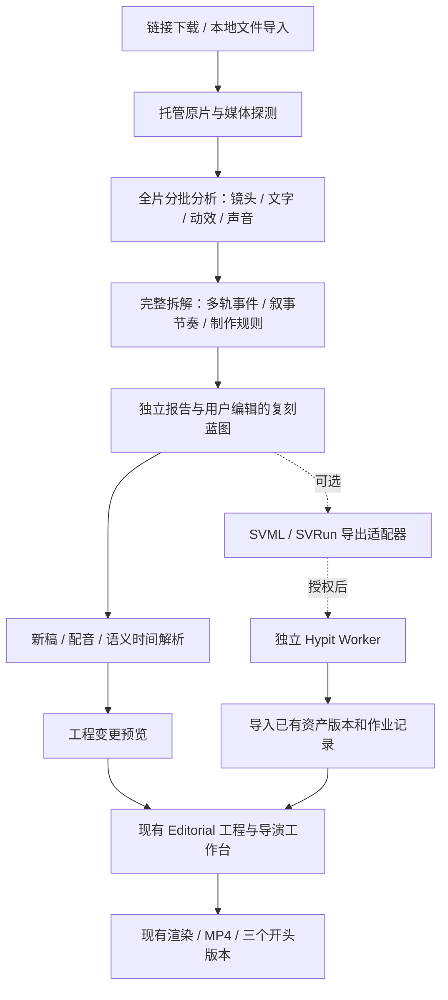

# 整体拆解视频 → 制作蓝图 → 复刻工程：详细落地方案

日期：2026-09-16。状态：方案交付，尚未实现。适用项目：StoryDream，基于 `codex/shotcraft-motion-library` 当前源码。

**主目标是整条视频的全维度拆解，再将拆解结果用于复刻。** 分析需覆盖内容结构、逐镜头画面、构图运镜、文字排版、转场动效、声音和音画节奏，不能只做文案提取和抽帧点评。建议自建完整拆解与制作蓝图，把 Hypit 的语义编排思路用于下游工程桥接，再按商业授权条件提供可选执行后端。Hypit 没有“输入任意视频即可返回完整拆解”的现成 API。

用户已确定两项前提：①按未来可对外收费分发设计；②先完成一条 20–30 秒中文解说片，再扩展三个开头版本。版本按 A 为首片、再新增 B/C，共三个输出规划。本轮仅编写方案，后续另行实现。

## 1. 要做成什么

用户导入一条参考视频，首先拿到可独立查看、修改和导出的整体拆解：全片总览、逐镜头表、视听多轨时间线和制作蓝图。后续才是修改主题、台词和素材，生成能在现有导演工作台继续编辑的分镜工程。替换配音或开头时，相关画面、字幕和音效重新定位，仍然适用的正文资产明确复用。

业务价值是缩短“看懂参考片 → 改写 → 编排 → 出变体”的路径。爆点归因属于模型解释，不承诺流量；观察到的内容必须能定位到证据。

**拆解默认覆盖原片完整时长，不以 20–30 秒或 120 秒截断，也不要求必须有口播。** 长片按窗口处理并合并，预算不足明确暂停和显示覆盖缺口。后续复刻层的首个案例才使用 26 秒、5 段中文解说，9:16、1080×1920、24 fps。自动生成舞蹈/多人表演、声音克隆、任意效果源工程恢复和百条变体不进入首个复刻验收；这不排除对这些原片内容作可证据支持的分析。

## 2. 方案文档与权威边界

| 文档 | 实施时解决的问题 |
| --- | --- |
| 本文 | 产品范围、整体架构、分析预算、商业分发与 Hypit 边界 |
| [整体拆解规格](full-decomposition.md) | 全片十类拆解维度、逐镜头与多轨结果、长片分批、声音分析、覆盖率；这是 M1 范围主规格 |
| [数据与运行契约](data-contracts.md) | 字段、版本、IPC、原子持久化、旧档兼容、恢复与费用状态 |
| [导演工程桥接](director-bridge.md) | 语义锚点、时间映射、ShotCraft、本地 B-roll、增量更新与复用 |
| [实施任务表](implementation-plan.md) | 按依赖拆分的改动位置、交付物、验证和发布顺序 |
| [流程与验收](acceptance.md) | 页面交互、26 秒样片、三个开头、量化标准和异常场景 |
| [前置源码评估](../../research/hypit-integration-2026-09-16/README.md) | Hypit 固定版本的一手证据、能力与许可核验 |

同一概念只保留一处定义：整体拆解范围及分批规则以 full-decomposition 为准；JSON/IPC 以数据契约为准；工程写入和时间映射以导演桥接为准；验收数值以验收方案为准。以下接口、模块和控制参数标为“新增”的均是待实施设计。

## 3. 三个阶段与出口

| 阶段 | 用户能完成的事情 | 完成门槛 | 依赖 Hypit |
| --- | --- | --- | --- |
| M1：整体拆解 | 链接/本地视频 → 全片镜头/文字/动效/声音轨道 → 音画关系/叙事节奏 → 可编辑报告与制作蓝图；独立于新稿生产 | 全时长与各维度覆盖可核查；逐镜头可回放；完整声音/动效维度有真实证据；人工修订受保护 | 否 |
| M2：原生复刻工程 | 新文案/配音 → 语义时序 → 分镜、字幕、配图/B-roll、动效 → 导演工作台 → MP4；再生成三个开头版本 | 一条 20–30 秒样片和三个版本通过验收；变体复用可核对 | 否 |
| M3：可选 Hypit | 导出受支持的 SVML/SVRun；经授权可执行本地构建，回收产物 | 固定版本适配、授权、重启/取消/资源可搬运验收全部通过 | 是，仅执行模式 |

M1 和 M2 构成可独立发布的产品，不等待 M3。M2 内按“静态配图与整镜头模板 → 对齐与模板内部事件 → 本地 B-roll → 变体”推进；所有承诺在首片中使用的能力必须在 M2 验收前完成。

## 4. 架构和数据所有权

四层数据分别负责：

1. **完整拆解文档**：分片保存逐镜头、多轨事件、声音、文字、叙事/节奏与覆盖矩阵，独立 reference revision；观察和推断分开，人工修订保留原始证据。它在没有新稿时就可以阅读/导出，重新配音不能改写它。
2. **当前蓝图**：独立 revision，保存新稿、稳定语义 ID、素材槽、事件和版本覆盖。分析重试的 runGeneration 与人工 revision 独立；生成报告只引用生成时的快照。
3. **已解析制作计划**：新配音确定之后生成目标时间、依赖签名、预算和待改工程差异。未知对齐不得伪装成可靠逐词时间。
4. **导演工程**：导出后独立保存的项目快照，继续使用现有素材版本、人工编辑、质量报告、预览和渲染。后续同步采用三方差异合并，不静默覆盖。

分析记录不是成片的运行依赖。创建工程时将实际使用的图片、音视频和必要参考资产复制到工程托管目录并校验内容哈希；仅保留来源元数据，不共享会随分析清理而失效的临时路径。归档不删除文件；删除分析记录后，已创建工程和 MP4 仍能打开。工程删除和资产回收遵循现有项目生命周期。

## 5. 全片处理、预算与能力边界

详细算法与十个维度见 [整体拆解规格](full-decomposition.md)。新版入口建议称为“快速概览 / 整体拆解”，避免将稀疏抽帧与全片分析混为同一种结果。

| 项目 | 快速概览 | 整体拆解 M1 |
| --- | --- | --- |
| 时间范围 | 保留旧报告行为 | 全片；不要求 10–120 秒选段；局部聚焦用于查看/补证据，不改变全片覆盖要求 |
| 基础扫描 | 沿用旧逻辑 | 全片镜头变化、音频活动/能量、文字变化候选 |
| 模型处理 | 默认 8、最多 40 帧 | 最长 30 秒核心窗口，前后各 1 秒上下文；过密则拆批 |
| 单批资源 | 旧模式上限 | 最多 16 观察单元，每单元最多 4 帧/1次视觉请求，合计最多 64 帧/引用 |
| 全片资源 | 旧模式记录 | 按扫描后的实际窗口/轨道数量汇总，不是整片仅 16 请求 |
| 内容 | 旧文本报告与模板 | 镜头、内容、构图运镜、字幕版式、转场动效、旁白配乐音效、音画节奏和制作规则 |
| 声音 | 原有 ASR | ASR 与真实音频事件分析分开；波形/节拍/瞬态为证据补充 |
| 长片 | 保留已有能力 | 逐批 checkpoint、跨窗去重/连接、分层汇总、全局覆盖矩阵 |
| 预算不足 | 明确失败/暂停 | 停止派发，保留已完成结果与待处理轨道区间，可恢复全片分析 |

本地导入按文件大小、空闲磁盘、解码能力与预计工作量预检，不设置任意时长或 1 GiB 的产品硬上限，不强制 720p。资源不足须在付费处理前说明实际缺口，长片流式分块处理。UI 通过主进程文件选择器取得托管媒体 ID。URL 保持 HTTPS/平台校验，本地来源不能通过假 URL 绕过。所有原片证据保留原文件绝对毫秒，区间音频时间只在适配层加一次 audioOriginMs。

有序静帧支持外观和状态比较；判断连续动作、转场过程必须有连续片段或足够密集的帧证据。Provider 原生视频理解和多图观察采用统一输出，但分别记录实际观察能力。音乐、音效必须读取真实音频，ASR 不能替代声音理解。没有音轨记为不适用，混合音轨难以辨识则待复核，缺该分析能力则显示未完成维度。

首期并发按本地媒体任务 1、视觉 1、音频模型 1、全局归纳 1 设置，并受共享 Provider 队列约束。自动付费重发为 0；显式重试有新增请求/费用计划，计入全片累计。预算、上下文窗口和 Provider 限制应通过拆批与恢复解决，不能用静默丢弃后半片解决。

快速报告升级为整体拆解创建新分析，复用合法托管输入；已有人工报告和工程不被覆盖。整体拆解先形成独立可读报告，用户之后再选择建立新稿与复刻蓝图。

## 6. 模型渠道、计划成本与执行纪律

复用 StoryDream 已配置的模型渠道和现有凭据读取机制，按能力路由文本、视觉、ASR、TTS、图片或视频，不把用户的 key/url 再写进蓝图、SVML、日志或工程。渠道不是同一协议的别名，模型清单、输入限制和费率需由对应 Provider 提供。实现时按项目长期记忆和 paid-api-channels 登记选择已配置渠道，本方案不硬编码某个付费模型。

计划成本分为分析、TTS、图片、视频四类；本地渲染另列预计耗时/磁盘空间。每一项记录输入签名、选定 Provider/模型、费率来源/时间、计价单位、数量、已复用资产及待执行请求。

`预估总额 = 各已知单价 × 预计用量 + 已提交未结算请求的保留额度`。这是预算视图，最终实付以 Provider 返回的用量或账单为准。按 token 计费时必须包含输出上限，多图计费和视频时长不能只按请求个数估价。

有未知单价时显示“费用未完整估算”，绝不填 0 元；默认执行范围内不自动提交未知价请求，用户可补充费率，或明确选择仅请求数上限继续。启用严格金额预算时，无法获得保守费用上界的请求不可派发；本地/自备素材可继续。预算判断必须在统一派发队列原子保留额度，避免并发请求各自低于余额但合计超限。

达到运行预算：停止后续派发并保存暂停原因；已经在服务端执行的请求继续追踪，不承诺撤销计费。修改预算后恢复同一可恢复计划。普通暂停、取消、超时、远端状态未知分别处理；状态未知先查询/对账，不自动发第二份付费请求。每次显式再生成都会创建新的成本计划，手动重试不绕过上限。

## 7. Hypit 的后期接入协议

核验基线为 Hypit `0.1.10`，提交 `98000342cc222392ac8813cca2f1977c979821a8`。M3 实施时仍须重验固定版本，不能对未来版本推定兼容。

### 7.1 商业分发路线

Hypit 的许可证是修改版 Apache-2.0。内部使用、替客户制作及成片商用被允许；收费分发 Hypit 或其衍生实现、为第三方托管功能、多租户服务需要商业授权。将 CLI 放在独立进程或让用户自行安装，不应作为绕过授权的产品设计。

M1/M2 自有代码不复制 Hypit 源码、组件实现、提示词资产或受限内容。普通语义锚点、版本化编排和依赖图由我们根据需求独立设计。M3 分成两种明确能力：

- **工程格式导出**：由自有转换器生成 SVML/SVS/SVRun 及自有/用户有权使用的资源，不捆绑上游运行时或组件。发布前核对输出格式、示例资产及相关商标/许可要求。
- **执行后端**：在商业授权范围明确后发布；记录允许的版本、部署方式、分发对象及归属展示要求。授权未落实时此功能保持不可用，M1/M2 正常交付。

### 7.2 适配器能力集

新增适配器职责为 `probeCapabilities → exportPackage → validateAndPlan → submit → reconcile → cancel → collectResult`，这是 StoryDream 内部契约，不冒称 Hypit 现有 API。

初始支持已有图片、整镜头视频、已完成的配音、定时字幕、明确支持的简单合成。ShotCraft Remotion 组件先用现有渲染器生成片段再导入；不能把 Remotion TSX 原样放进 HyperFrames。字体、转场或图层不在子集内时给出 `UNSUPPORTED_FEATURE` 和定位，用户可选择预渲染，不能静默丢掉效果。

调用顺序使用已核验 CLI 的 `check`、`plan --json`、`pricing`、`build --json`、`status/logs --json`、`cancel`、`get --output ... --to ...`。JSON 能力按具体命令确认，不假设所有子命令都接受同一参数。计划/价格资料只用于本方预算计算，Hypit 本身不计算总价、不执行预算上限。

| 环节 | 适配器必须保存/保证的内容 |
| --- | --- |
| 执行前 | adapter 版本、Hypit commit、导出包哈希、运行目标、能力清单、输入资源 manifest、计划 ID |
| 提交时 | 持久化本地请求记录再启动 CLI；保存 build ID、worker/store 标识及节点映射；中断窗口进入待对账，不能直接重提 |
| 运行中 | 状态与日志游标、每个 node 的输入签名和输出关系；应用关闭/重开后根据 build ID 继续观察 |
| 取消 | 调用已验证取消接口并查询终态；结束 CLI 观察进程不代表后台 Worker 终止 |
| 失败续作 | 创建新 Build，明确用 `build-record/satisfy` 指定已完成产物；先由本方验证语义依赖，再接受上游类型校验 |
| 结果 | 保存到新的 staging 路径，验证文件/时长/哈希后登记 ProductionAssetVersion；失败不污染当前选中素材 |

依赖独立 Node ≥22.15；本地 WhisperX 另需 Python/uv/模型。字体、中文路径、24/30 fps、无音轨、中文夹英文/数字、Windows 进程与重启都需实跑。首个试验仅用现有素材本地渲染，一条原版和一个换标题/产品图的版本，模型调用为 0；不借此宣称所有 Provider 已兼容。

执行并发初始为 1，按机器资源评估后再提高；不能照搬上游示例的大并发。仅执行应用自有且经过审核的组件，外部工程的任意代码包不能直接运行；进程隔离不等于安全沙箱。Hypit 的 SQLite/Worker/Studio 不并入 StoryDream 主存储与主界面。

## 8. 发布策略与暂不决策事项

新增独立开关 `viralBlueprint`、`viralDirectorBridge`、`hypitBackend`，作为待实现配置名。默认关闭，从本地夹具、内部样片、受控使用逐级开启。关闭新入口时，已经保存的蓝图仍可只读查看/导出；不删除数据、不自动降级覆盖旧档。M1/M2 的持久化先做加法迁移，旧报告与普通任务路径保留。

待实施阶段通过样片确定的参数包括：镜头候选阈值、实际模型选择与费率、中文强制对齐后端、视觉请求批次和预算。对齐后端须能提供同一条新配音的可靠时间证据；当前 `measureProductionNarrationAlignment` 仅比较时长，不能替代声学强制对齐。降级到人工/估算的规则已纳入契约，不因后端选择未定而夸大现有能力。

实施顺序、任务边界及通过标准见 [实施任务表](implementation-plan.md)。本轮验证范围为源码核对、文档一致性与 UTF-8/链接检查；样片质量、执行性能、模型费用和 Hypit Windows 运行均仍是后续验收项。
