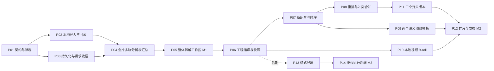

# 实施任务、依赖与发布计划

日期：2026-09-16。状态：待实施。用户本轮只要求方案；本文件中的源码、接口、测试和里程碑均未执行。

范围与预算见 [总方案](README.md)，M1 主规格见 [整体拆解](full-decomposition.md)，数据定义见 [数据契约](data-contracts.md)，工程编译与时间规则见 [导演桥接](director-bridge.md)。整体拆解验收 D01–D08、后续复刻验收 A01–A14 见 [验收方案](acceptance.md)。本文使用 P01–P14 作为统一实施编号；P04 拆为四个工作包，其他文档的局部卡片按此合并，不重复实施。

## 1. 推荐执行顺序

每个编号代表一个可评审的工作包，可以按实际改动量拆成多个 PR。涉及新增接口的工作包须同时提交 schema、API 清单、preload、主进程和 browser fallback，不能先合入悬空接口再等待其他 PR 补齐。P09 与 P10 可在 P07 接口确定后并行，合并前统一渲染契约；P13/P14 不进入 M2 的关键路径。

## 2. M1：完整拆解整条参考视频

| 编号 | 任务和真实改动位置 | 完成定义 | 验证 |
| --- | --- | --- | --- |
| P01 | 新增 `src/shared/viral-replication-contract.ts`；调整 `types.ts`、`viral-analysis.ts`、`ipc-contract.ts` 的解析边界 | 原报告 legacy v1 可读；新报告 v2 引用分片式完整拆解 manifest；后续独立 blueprint v1；镜头/多轨事件/覆盖矩阵不受单个 JSON 上限截断；秒/毫秒只转换一次 | 旧报告夹具；未知版本、分页坏引用、跨窗事件、中文/emoji 选区、重复短语、0 值时间 |
| P02 | 新增 `electron/viral-replication-service.ts`；扩展 `electron/main.ts`、`html-video-runtime.ts`、来源获取适配；同步 IPC 全链 | 本地导入分为选文件/托管探测和正式分析两步；默认全片、磁盘与解码资源预检；媒体 ID 回放；URL 保持原校验 | 取消选择、失败清理、中文路径、旋转 MOV、超过 120 秒整片、删除原文件后恢复、跨记录媒体访问拒绝 |
| P03 | `src/shared/storage.ts`、上述 service、`viral-analysis.ts`；新增运行收据/计划 schema | DB 加法迁移；不可变 JSON + DB 当前指针；逐单元 checkpoint；generation/revision CAS；费用与请求派发前登记、超时对账；归档/删除与导入/保存/导出互斥 | 四类中断窗口、DB 保存失败、迟到结果、同时保存、受管目录清理、金额/数量预算并发保留 |
| P04a | 新增 `src/shared/viral-deep-analysis.ts`；扩展 `viral-runtime.ts` | 全片逐帧低分辨率扫描、声音活动/能量、OCR 变化候选、窗口和全片预算计划；64/16 仅单批上限 | >120 秒全覆盖；短闪切；长镜头；无声片；窗口 core 并集无空洞 |
| P04b | 新视觉/连续视频能力适配器；扩展结构化模型输入和验证 | 全部镜头、主体/构图/运镜、文字版式、剪辑转场、动效时间事件；密集证据/视频消费可证明，未知参数待复核 | 全片镜头召回/精确率；OCR/动效夹具；静帧能力不冒充连续感知；跨批去重 |
| P04c | 新音频事件能力适配器；扩展 ASR 分块、局部信号测量、视听关系分析 | 配音/对话、配乐、音效事件与时间、语速/停顿、音画同步；真实 audio-range；无音轨与未分析区别 | 混合音轨、无旁白音乐片、至少 5 个声音事件、长音乐跨窗口、未知费率/能力缺口 |
| P04d | 分片 manifest、分层结构汇总、全片覆盖与规则抽取 | 所有处理单元可恢复；全片镜头/音轨连续；总览与制作规则可下钻；独立拆解完成后才选择建立新稿蓝图 | D01–D06/D08；局部修订只失效相关层；没有“16 请求后自动完成整片” |
| P05 | `src/features/viral/ViralAnalyzerPage.tsx`、`ViralReport.tsx`；拟新增拆解工作区视图与 `ViralBlueprintEditor.tsx`；复用 `src/ui` | 全片总览、逐镜头表、视听多轨时间线、制作蓝图；分页/虚拟列表；边界/文字/声音/解释修订；报告和 JSON 导出；新稿制作独立入口 | D07；两种窗口×两主题；焦点/选中 ID 稳定；CAS 不丢草稿；长片滚动可用；无配音仍可独立完成拆解 |

M1 发布出口：从头到尾的整体拆解已独立可用，包含十类维度、逐镜头/多轨证据、全片节奏与制作规则，D01–D08 通过。用户没有生成新稿/新配音也能得到完整报告。尚未分析的声音或动效轨道不能当成空数组掩盖；M1 不是仅提供少量抽帧和口播骨架。

## 3. M2：蓝图变成真实可重排工程

| 编号 | 任务和真实改动位置 | 完成定义 | 验证 |
| --- | --- | --- | --- |
| P06 | 新增 `viral-replication-director.ts`；扩展 `editorial-collage.ts`、`storage.ts`、service 及 IPC 全链 | 按蓝图直接编译 beat/shot/cue/layer/asset；新增原子创建方法，不走普通 paste/starter；生成基线、绑定映射和素材独立副本；预览差异后幂等建工程 | 不同来源/目标时间夹具；合法工程 roundtrip；双击只建一次；staging 失败无半成品；删除来源不破坏工程 |
| P07 | 新增 `viral-replication-timing.ts`；扩展 `audio-alignment.ts` 与实际配音 runtime；接入 `director-generation.ts` 产物完成路径 | 按段生成/使用新配音；获取同一音频的词级或人工对齐；文本范围→token→事件；明确 estimated；保存局部与全局映射；按现有 24 fps 导出 | 中英数字、重复词、多对一 token、改稿、换声、缺词/0 时间；真实音频人工标注校验；24/30 fps 纯函数夹具 |
| P08 | 新增 `viral-replication-merge.ts`；调整 `editorial-narration-timing.ts`、字幕/音效失效、`director-render.ts` 指纹；扩展更新预览 UI | 新配音驱动重排；语义偏移/局部固定/全局锁定分别处理；三方字段合并；删除 tombstone；旧结果保留为未选中；应用更新和回退原子化 | 改开头导致正文平移；人工位置/音量/删除保留；越界时间和同字段冲突阻止自动应用；延迟作业不覆盖新编辑 |
| P09 | 新增 `shotcraft-timing.ts`；扩展 `vox-animation` schema、`shotcraft-recipes.ts`、`src/features/vox-animation/shotcraft/`；扩展字幕 schema 与 HTML/Remotion 两套字幕渲染 | revision 2 先支持逐词纸面压印与纸卡立起的显式标记；视觉词与旁白范围显式映射；选择性字幕强调可表达且两路径一致；其余四模板为整镜头控制；旧 revision 1 不改表现 | 词前/词时/词后帧；任意 seek 确定性；中文长文/数量上限/比例；v1 对照；预览导出一致 |
| P10 | 扩展 `editorial-collage.ts`、`director-render.ts`、`electron/director-renderer.ts` 及导演预览/素材选择 | 新增明确 local-video 整镜策略，1 倍速、source trim、默认静音；可选择将原声抽成音轨；不伪造 AI job，不放开 living-poster 校验；视频不足时长阻止输出 | 实际本地片段非零裁切、首尾 seek、短视频、无音轨/有原声、中文路径；与字幕/旁白混音一致 |
| P11 | 扩展 bridge/service；新增变体选择/差异 UI，沿用独立 Editorial task 和资产版本 | A 为首片，B/C 为新增开头，共 3 个输出；每变体独立可变工程；正文资产和局部对齐复用，选择状态不共享；增量成本表 | 正文新增 Provider 请求 0；开头改变仅使相关依赖失效；编辑/删除 B 不影响 A/C；全局时间按新开头变化 |
| P12 | 新增样片夹具、验收 runner/记录；扩展相关 QA 脚本和开关配置 | 先 A 版 20–30 秒中文片，后 A/B/C；24 fps、1080×1920；本地 B-roll 小样通过；仅允许无阻断项工程导出；M1/M2 开关与回退完整 | A01–A14；实际 MP4 `ffprobe`、人工听检、关键帧及 UI 截图；关闭/重开；Windows 打包冒烟 |

P06–P09 完成后可先交付内部静态 B-roll 样片作为阶段检查。对用户宣布 M2 完成前，P10 的本地整镜视频、P11 的三个版本和 P12 的发布验收均须通过；多视频图层叠加、另外四模板内部语义标记和产品 30 fps 选项另列后续范围。

## 4. M3：可选 Hypit

| 编号 | 任务 | 完成定义 |
| --- | --- | --- |
| P13 | 拟新增 `src/shared/viral-replication-hypit-export.ts` 与格式/资源 manifest 校验 | 从自有蓝图/已解析工程输出支持子集，固定 schema 与版本；不打包上游代码；不支持的效果列诊断或使用经选择的预渲染片段；缺资源/字体明确阻断 |
| P14 | 拟新增 `electron/hypit-backend.ts` 与后台任务记录；Provider 适配另按能力拆分 | 商业许可范围落实；固定 commit；独立 Node；计划估价、build 收据、恢复观察、真正取消、显式产物复用、结果回写；原版/变体本地素材试验模型调用为 0 |

P14 发布前不只验证 happy path：需覆盖提交成功但本地未记 build ID、Worker 脱离应用继续运行、取消未确认、任务失败后新 Build 复用、`get` 落盘失败和中文路径。无法确认远端是否已创建作业时进入 reconciliation，不通过再执行一次 build 猜测状态。

## 5. 依赖失效与请求复用矩阵

“复用”必须同时满足文件存在、内容 hash 匹配、输入依赖匹配和用户未要求重新生成。表中“重算”包括纯本地计算，不一定产生模型费用。输入签名只包含本节点真实依赖，避免把整份 blueprint revision 粗暴当作每个素材的缓存键。

| 变化 | 原片 ASR | 观察/蓝图 | 新配音/对齐 | 图片/视频素材 | 时间/最终渲染 |
| --- | --- | --- | --- | --- | --- |
| 替换原片或分析区间 | 对应音频输入变化则重新 ASR | 采样、观察和依赖摘要重算；建立新分析 | 已导出工程保持独立，按新方案显式更新 | 同左 | 同左 |
| 仅调整证据采样 | 复用原音轨相同产物 | 仅新增/变化单元请求，重新汇总 | 不自动改已编辑新稿 | 不受影响 | 当前工程不自动变动 |
| 只换视觉分析模型/提示版本 | 复用 | 对应观察与其汇总失效 | 新稿由用户接受更新后才变化 | 依据已接受内容判断 | 不自动覆盖 |
| 改开头文案 | 复用 | 参考证据保留；新稿 revision +1 | 开头配音/对齐失效；正文局部证据复用 | 依赖开头含义的素材失效，正文复用 | 新开头时长及正文全局起点重算；整片重渲染 |
| 改正文一句 | 复用 | 原片不变；该段锚点需重核 | 对应段失效 | 只影响关联内容素材 | 该段局部时序及其后全局起点重算 |
| 换音色/速度 | 复用 | 新稿不变 | 应用范围内配音、实测时长和词级对齐失效 | 静态图片可复用；口型等音频依赖视频必须失效 | 重排并重渲染 |
| 换角色/产品图 | 复用 | 相关素材槽覆盖变化 | 名称未改则复用 | 依赖该对象的图片/视频失效 | 构图、遮罩和渲染重算 |
| 改比例 | 复用 | 新稿不变 | 复用 | 原文件可保留；裁切/重绘和成片视频兼容性重核 | 布局、字幕安全区和渲染失效 |
| 改模板/配色/字幕样式 | 复用 | 模板能力及视觉绑定重核 | 台词未变则复用 | 原图复用；依赖模板的预渲染片段失效 | 局部布局、动效与渲染失效 |
| 音效时间调整/混音修改 | 复用 | 对应音效绑定变化 | 旁白证据保留 | 音效文件复用 | 混音、渲染和 QA 失效 |

`pinned` 只锁定用户选中的资产版本，不证明该资产仍符合新台词/产品。失效但被 pin 的资产保留历史选择，工程显示冲突；用户可换素材、修改依赖或显式确认人工沿用。确认需绑定本次输入签名，不能为未来所有变更永久跳过检查。

新生成的音频/图片先写新版本，再按当前 fingerprint 判断能否选中。失败、取消或过期的结果不能覆盖仍可播放的旧版本。跨变体先采用工程内独立副本与内容 hash 复用识别，无须在 M2 新建全局 blob 仓库；复制字节不等于重新向 Provider 生成。

## 6. 实施前后的检查与证据

实施前记录分支、HEAD、工作区差异和相关测试基线。仅提交当前工作包的文件，不将用户 PPT、临时目录或其他任务产物一起加入。先完成整体拆解验收，再开展导演生产改造，避免下游样片掩盖上游分析能力缺口。

每个工作包先运行与改动有关的既有测试及新增行为测试，再运行 `npm run typecheck`。合并前按仓库要求执行 `npm test`、`npm run build`；涉及 UI/渲染的工作包再运行对应 QA，避免每个纯 schema 改动都重跑完整视频矩阵。

已存在且可扩展的入口：

- 分析/数据：`tests/viral-analysis.test.ts`、`viral-runtime.test.ts`、`viral-contracts.test.ts`、存储与 history 测试。
- IPC：`tests/ipc-contract.test.ts`、`electron-ipc-contract.test.ts`、`ipc-inventory.test.ts`。
- 导演：字幕、音频渲染、document-sync、generation-stale、render-fingerprint 相关测试。
- 模板：`tests/shotcraft-templates.test.ts`、`scripts/qa-shotcraft.ts` 与相关 render 脚本。
- 实机：`npm run smoke:electron`、`npm run qa:editorial`，加首片与变体场景；不将现有冒烟通过当作新功能已验收。

样片验收包至少包含原始/新稿、媒体与音频 hash、人工时间标注、蓝图修订、解析时间线、工程快照、请求/费用摘要、截图、MP4 和 `ffprobe` 结果。对齐质量分别报告实测和 estimated；本地纯计算、付费请求、等待远端的耗时分别记录。首次测量才建立性能基线，不预先编造“几十秒完成”或固定单片成本。

## 7. 发布与回退

| 发布点 | 开启能力 | 回退方式 |
| --- | --- | --- |
| 内部 M1 | `viralBlueprint`（包含整体拆解入口） | 关闭新分析/编辑入口，保留分片报告只读/导出与旧报告出口；无 schema 降级重写 |
| 内部 M2 | `viralDirectorBridge` | 关闭新建/更新桥接，已有原生工程继续预览导出；单工程回退上一生成快照 |
| M2 可分发包 | 原生闭环、B-roll、3 变体验收后开放 | 数据加法迁移与兼容读取；保留渲染 revision 1，revision 2 仅用于显式选择的新模板 |
| M3 可选包 | `hypitBackend`，以授权与能力检查为前提 | 停止新提交、保留历史产物与运行日志；已提交任务持续对账或显式取消 |

关闭功能开关不会取消服务端已付费任务。版本回退需使用兼容读取策略或迁移前备份；不保证完全不认识新 schema 的旧二进制能继续编辑新工程。任何中途故障都不应通过删除新列、清空历史和取消选中所有资产来“回退”。

工程量按复杂度安排：P01/P02/P05 为中等；P03/P04/P06/P07/P08 为高；P09/P10 涉及渲染回归，为中高；P11/P12 为中等；P14 为高且依赖授权及环境验证。日历工期在实施开始时根据基线和人员确定，先验收一个工作包再校准下一包；不将本表换算成未经验证的固定交付天数。
