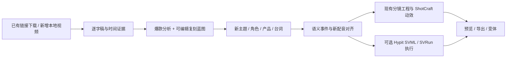

# Hypit 融入爆款拆解：接入评估

后续落地方案已按用户“整体拆解”的要求定稿：[整体拆解规格](../../plans/viral-replication/full-decomposition.md) 与 [完整实施方案](../../plans/viral-replication/README.md)。本文保留前置源码评估依据；其中初步的短片范围与内嵌蓝图建议，以新方案的全片分批分析、独立拆解文档和当前蓝图引用契约为准。

日期：2026-09-16。上游：[hypit-ai/hypit](https://github.com/hypit-ai/hypit)，版本 `0.1.10`，检出提交 `98000342cc222392ac8813cca2f1977c979821a8`（2026-09-16 03:46 +08:00）。本项目基于当前 `codex/shotcraft-motion-library` 源码分析。

## 判断

适合融合，最有价值的是把现有“爆款报告 + 再创作稿”扩展为“有证据、有语义时序、能重新执行的复刻工程”。建议先建立我们自己的复刻蓝图与分镜桥接，再提供 Hypit 可选执行适配器。产品主线保留 StoryDream 的项目、素材、模型渠道和分镜工作台。

Hypit 的参考视频理解主要由外部 AI coding agent 按技能说明观察视频、转写、抽帧，记录分析并编写 SVML。已检查的 CLI 没有接收任意视频就直接返回完整可执行复刻工作流的自动分析接口。“1 command, 100 variants, 100M views”是项目宣传，不能当作自动化程度、视频效果或流量收益保证。

## 两者的互补点

| 能力 | 我们已有 | Hypit 可提供或启发的增量 | 建议 |
| --- | --- | --- | --- |
| 输入与获取 | 抖音、快手、B站下载、任务记录与恢复 | 本地视频、时间片段、台词关联帧网格、视觉突变候选 | 复用下载链路，补本地输入、按需密集采样与时间证据 |
| 爆款理解 | 开头/结构/结尾/爆点、标题封面、生图提示词 | Agent 逐段记录对象的入场、变化、持续、退场与台词关系 | 增加带来源时间的观察模型；Agent/模型理解工作仍需我们编排 |
| 时序 | 转写已有逐词时间，导演工作台已有字幕对齐和时间线 | Script 段落、词范围、语义瞬间映射到表演素材，再投射到时间轴 | 保留稳定语义 ID，让新配音后画面与音效重新定位 |
| 再创作 | 生成新故事、分镜建议、普通生产任务 | SVML 描述素材、字幕、B-roll、图形和声音的依赖与关系 | 增加可执行复刻蓝图，可导出至我们工程或 Hypit |
| 变体 | 参数和模板复用 | Run 选择目标与已完成产物，显式复用生成素材 | 首先做 3 个钩子版本；变更依赖识别和总费用估算由我们补齐 |
| 制作与交付 | 分镜/图层、AI视频、字幕/音频、Remotion与ShotCraft动效 | HyperFrames、生成请求、独立Worker、结果存储、Studio | 执行层可选接入；不并入整套Studio和存储系统 |

本地链路证据详见 [local-fit.md](local-fit.md)。目前抽帧默认 8 张、最多 40 张，按时长均匀采样；`viral-runtime.ts:486` 甚至明确要求不分析转场、滤镜和动效。`ViralFrameAnalysis` 是时间点，`ViralRecreationDraft.storyboardHints` 是字符串数组；`createViralProductionTaskInput` 将它们拼入生产任务提示词。这些契约无法表达“说到某句话时切入配画面，再触发某个动效”。

Hypit 的 `media boundaries` 只是视觉变化候选，不能单独证明语义镜头或完整动效已识别。现有 `words[]` 也不等于可靠声学对齐，缺少时间戳的转写响应可能保留 0 值，需要区分实测与估算。

## 建议的数据与执行边界

以下是建议的新设计，不是 Hypit 已提供给 StoryDream 的接口。

建议给 `ViralAnalysisResult` 增加可选、带版本号的 `replicationBlueprint`：

- `referenceEvents`：来源视频时间范围、观察到的画面/字幕/音效事件、证据帧或片段、对应逐词稿、置信度与人工修订。观察和推断分开保存。
- `scriptSegments`：新稿的钩子、论证、证据、转折、收束/CTA，使用稳定 ID 并关联原片对应功能。
- `semanticEvents`：关联段落/词范围/语义瞬间，记录要触发的画面、字幕强调、音效与动效；生成新语音后才解析为新片时间。
- `assetSlots`：角色、产品、B-roll、音乐等可替换素材位，关联现有资产版本。
- `variants`：每个版本改了什么、明确复用哪些资产、需要重新生成哪些依赖。素材复用需校验兼容性，不能仅凭同名节点复用。

蓝图通过运行时 schema 校验后保存，旧结果保持兼容。保留当前“保存故事/图片模板”和“生成普通生产任务”出口，新增“生成复刻工程”。渲染器只接收已解析的时间与素材，不在渲染过程中调用模型或推断语义。

## 分期实现

**第一期：把拆解结果做实。** 增加本地视频输入、视觉变化候选与重点区间密集抽帧、带逐字稿的帧证据、可点击回看片段、蓝图 schema 和 checkpoint。首批范围为口播 + B-roll 或纸拼贴解说。结果仍可保存模板并生成普通任务。

**第二期：从蓝图生成我们的分镜。** 换主题/台词后生成新语音并对齐语义事件，自动写入现有图层、字幕、音效和动画选择。刚接入的六个 ShotCraft 模板可作为蓝图的动效实现；原参考时间仅作为证据，不直接用于新配音。先实现一个 20–30 秒模板和 3 个开头版本，验证改稿后画面能跟随，正文资产可复用。

**第三期：可选 Hypit 执行。** 使用独立 Node 22.15+ 环境，通过已核实的 `plan/pricing/build/status/cancel/get --json` 等 CLI 接口通信。每次保存 Hypit 的 build ID、状态和产物映射，以进度事件呈现到我们任务中。下载器和模型渠道仍由明确选择的适配器负责。不要把退出观测进程当作取消任务，Worker 与终端分离。

SVML/SVRun 可作为导出格式；作为可执行后端接入时，需要另外验证项目路径、资源 URI、取消、重启、字体、中文时间对齐及 24/30 fps。双方都使用 HTML/HyperFrames 不代表工程文件和资源协议可以直接互换。

独立执行器的最小技术试验可先使用已有视频、图片和配音，完成原版及替换标题/产品图的变体，只做本地渲染。它验证文件转换和产物复用，不把生成模型质量混入适配器验收。`transcribe` 是即时调用，没有 Build 的持久收据语义，需要由我们的任务队列记录。组件执行是可信代码环境，进程隔离不是安全沙箱，外部用户任意组件包不能直接接收执行。浏览器并发按机器内存设置，不能照搬示例中的 64 进程。

## 许可证、渠道与运行限制

1. [许可证](https://github.com/hypit-ai/hypit/blob/98000342cc222392ac8813cca2f1977c979821a8/LICENSE)是修改版 Apache-2.0。内部使用、为客户制作视频、成片商业使用明确允许；把 Hypit 或衍生代码随收费软件分发、提供第三方托管功能或多租户服务需要商业授权。CLI、运行报告和衍生界面的名称/标志保留另有要求。把它放进子进程并不自动免除商业许可条件。
2. 若 StoryDream 后续收费分发，优先独立实现通用的时间证据和语义蓝图；直接使用 Hypit 实现的分发方案须落实授权。这里的独立实现建议不等于从受限源码复制后改名。
3. 官方默认托管 Provider 是 HypiHub；已有其他模型渠道的凭据不会自动兼容。不同接口需要实现 Provider，或者先用我们现有渠道产出素材，再将素材交给 Hypit。
4. 上游 `0.1.10` 有 112 个 packages 目录，包含独立 Worker、SQLite、资源/结果存储、Studio和模型执行体系。全部并入会增加维护面；Windows 有处理代码，但本轮没有安装和运行验证。
5. 中文语义对齐有明确 `zh` 支持，仍需用中文夹杂英文名、数字、多音字和语速变化实测。WhisperX 本地运行需要 Python/uv 和模型资源，不能把安装技能等同于环境就绪。
6. 已完成素材的跨 Build 复用必须通过 `build-record/satisfy` 显式选择；重跑不会自动命中所有旧产物。`pricing` 提供费率资料及待执行请求，Hypit 本身不计算总价。批量变体仍需我们做预算与依赖管理。

## 验收标准与本轮边界

建议用同一条中文短视频比较现有快速拆解与新增深度蓝图：能否捕捉等距抽帧遗漏的开头/转折，证据能否定位回放，新台词变长后字幕/B-roll/音效能否跟随，三个版本是否复用正确素材，失败后恢复是否重复花费，以及总耗时、成本和导出结果。先验证这些，再扩大到访谈/真人表演和大批量变体。

本轮完成文档和源码静态核查，没有安装 Hypit、没有执行上游测试或渲染，没有访问真实用户素材或调用付费模型，也没有修改产品代码。因此结论是架构可接入、价值明确；实际可用性需按上述首个样片验证。

## 一手依据

- [项目定位与示例](https://github.com/hypit-ai/hypit/blob/98000342cc222392ac8813cca2f1977c979821a8/README.md)
- [参考片理解工作由 Agent 完成](https://github.com/hypit-ai/hypit/blob/98000342cc222392ac8813cca2f1977c979821a8/skills/hypit/references/creation/reference-video.md)
- [Script 与稳定语义锚点](https://github.com/hypit-ai/hypit/blob/98000342cc222392ac8813cca2f1977c979821a8/packages/script/README.md)
- [时间绑定与语义范围](https://github.com/hypit-ai/hypit/blob/98000342cc222392ac8813cca2f1977c979821a8/packages/temporal-markup/README.md)
- [中文 WhisperX 对齐](https://github.com/hypit-ai/hypit/blob/98000342cc222392ac8813cca2f1977c979821a8/packages/whisperx/README.md)
- [明确选择已有产物](https://github.com/hypit-ai/hypit/blob/98000342cc222392ac8813cca2f1977c979821a8/packages/run-markup/README.md)
- [Provider 扩展与渠道选择](https://github.com/hypit-ai/hypit/blob/98000342cc222392ac8813cca2f1977c979821a8/docs/guide/providers.md)
- [运行生命周期](https://github.com/hypit-ai/hypit/blob/98000342cc222392ac8813cca2f1977c979821a8/docs/guide/runtime.md)
- [真实CLI及机器接口](https://github.com/hypit-ai/hypit/blob/98000342cc222392ac8813cca2f1977c979821a8/packages/video-cli/README.md)
- [预算与费率资料的边界](https://github.com/hypit-ai/hypit/blob/98000342cc222392ac8813cca2f1977c979821a8/skills/hypit/references/production/builds.md)
