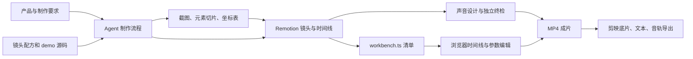

# video-shotcraft 项目分析

核验日期：2026-09-15。对象为 [Vincentwei1021/video-shotcraft](https://github.com/Vincentwei1021/video-shotcraft)，当前 main 提交 `5e71af35a2daee492dd3ea93e5e8903f32dcd13c`，提交日期 2026-09-09。本报告依据实际仓库源码、配置和本机验证；未运行付费模型，也未渲染整片。

**判断：这是值得借鉴的 Agent 视频制作工具库，最有价值的是调校后的镜头代码、配方说明和制作质量规范。Motion Workbench 已有完整的基本编辑链路，但跨平台运行、参数开放程度和工程保存能力仍需要完善。对 StoryDream，优先接入精选镜头组件和配方元数据。**

**项目定位与真实规模**

它让 Claude Code、Codex 等编码 Agent 承担产品理解、分镜、截图采集、动画代码、声音设计和终检，Remotion 负责逐帧渲染。基本动画通过 React、CSS、SVG 和部分 Three.js 实现，不要求每个镜头调用视频生成模型。最终效果仍取决于素材、分镜选择、参数适配与验收。

核心场景是网页/桌面产品宣传片、功能演示、品牌开场和发布片；部分卡片适合知识解释视频。其完整流程主要围绕产品视觉与音乐节奏组织，不能据此假设已具备长篇旁白的视频生产系统。

| 内容 | 实际核对 | 正确理解 |
|---|---:|---|
| 镜头配方卡 | 157 张 | 用途、时长、能量、参数、坑点及准确源码路径 |
| Gallery 风格变体 | 214 个 | 一张卡可以含多个变体 |
| 独立 demo TSX | 218 个 | 另有 3 个公共 fixtures，共 221 个 TSX 文件 |
| Workbench 可注册 demo | 216 个 | 生成器条件筛选后，排除 ClipCardLooping 与 VerticalTicker |
| 完整影片模板 | 1 套 | Ink Press：1085 帧、30 fps、1920×1080、约 36.2 秒、10 镜头 |
| 卡片分类 | 10 类 | 运镜、数据、特效、交互、开场、收尾、节奏、转场、文字、UI 入场 |

214 不能解释为 214 套完整视频模板；216 也不代表每个组件都有文字和样式编辑面板。统计来源：[Gallery 索引](https://github.com/Vincentwei1021/video-shotcraft/blob/5e71af35a2daee492dd3ea93e5e8903f32dcd13c/gallery/api/library.json)、[索引生成器](https://github.com/Vincentwei1021/video-shotcraft/blob/5e71af35a2daee492dd3ea93e5e8903f32dcd13c/workbench/scripts/gen-index.mjs)。

**架构与工作流**

| 层 | 主要文件 | 技术职责 |
|---|---|---|
| 制作调度 | SKILL.md、references/pipeline.md | 模板、自主创作、共同创作三种模式；自由创作为阶段 0–7 |
| 动效知识 | references/shots、gallery/api/library.json | 将叙事意图映射到镜头，不必凭名字重新发明效果 |
| 动效实现 | demos、assets/lib | 帧驱动的组件、缓动、种子随机、2.5D 页面相机、视频卡片 |
| 完整示例 | template | Ink Press 与单一时间表，提供 workbench.ts 接入范例 |
| 交付编辑器 | workbench | React 19、Zustand、Vite 6、Remotion 4.0.484、schema 面板 |
| 外部交付 | jianying-export | Python 导出剪映底片切段、字幕与音频 |

Workbench 使用 `Project → Track → Clip`。clip 保存起点、长度、源裁入点、速度、图层变换和属性；组件由 CardDef 注册。预览与导出共用 MainComposition，导出由 Vite 本地服务启动 Remotion CLI。`src/workbench.ts` 显式描述原片各轨与组件，用户编辑的是原组件实例及开放参数。它不支持从任意 MP4 自动恢复源码层级。

这种设计的价值是把“Agent 写代码”与“用户交付后微调”接起来。约束则是制作时必须写清单，且组件必须事先开放 props/schema。源码：[编辑数据模型](https://github.com/Vincentwei1021/video-shotcraft/blob/5e71af35a2daee492dd3ea93e5e8903f32dcd13c/workbench/src/types.ts)、[工作台接入契约](https://github.com/Vincentwei1021/video-shotcraft/blob/5e71af35a2daee492dd3ea93e5e8903f32dcd13c/references/workbench.md)。

**真正值得学习的部分**

- **镜头知识与代码成对保存。** 配方含明确的视觉意图、节奏数值、缓动、运动方向和失败案例。以纸胶带卡为例，胶带落下、卡片停晃、投影变薄、主体下沉要在同一时刻协作，这些约束比一个“纸张动画”名字更有复用价值。
- **真实页面采集体系。** 整页 2x 截图、元素切片和 layout.json 共用坐标系，PageCam 在其上推拉和旋转。针对 3D 放大后的文字模糊，代码使用布局级 CSS zoom，并为特写安排更高分辨率素材。这体现了具体制作经验。
- **节奏与可读性规范。** 品牌落定停留、批量动画结束留白、少用全屏冲击、SFX 钉动作帧、先确定视觉方向再制作，均写成可执行规则。
- **时间表复用。** 模板的镜头、字幕、转场和音效表由原合成与工作台清单共同引用，减少手抄时间表产生的漂移。
- **已有工程验证。** CI 包括纯函数单测、demo 严格编译、图库同步、预览资源检查、工作台构建及 demo 首帧冒烟。其验证范围有边界，但项目已经投入了基础维护工作。

**主要问题和使用边界**

| 问题 | 证据强度 | 影响与建议 |
|---|---|---|
| Windows 启动/构建阻碍 | 本机复现 | 依赖安装成功，`npm run build` 在 prebuild 创建素材符号链接时 EPERM，尚未进入 tsc。应先适配目录链接、权限与替代复制策略 |
| Windows 路径、进程命令 | 静态源码确认，未逐项运行 | gen-index 的 path.relative 未将反斜杠转换为模块路径；导出依赖 rsync 与 POSIX `.bin/remotion`；子进程缺 error 监听。本机无 rsync |
| 大量 demo 无参数面板 | 源码确认 | demoCards 统一 `schema: []`；可裁剪、变速和变换图层，但修改文字、色彩需要先改组件 props/schema |
| 变速为固定倍率 | 文档及数据结构确认 | 0.25×–4× 匀速重映射，无曲线变速；README 的 speed-ramp 容易引起更高预期 |
| 工程持久化偏轻量 | 源码确认 | 同一站点使用一个 localStorage 项目槽，切工程后会被后续保存覆盖；撤销不是多项目持久存档，应显式导出 JSON 或改为项目独立存储 |
| 分割会影响部分动画 | 原 store 函数逻辑探针确认 | 60 帧字幕在第 30 帧分割后，按原组件公式第 29 帧透明度由 1 降为 0.125。源动画时长和剪辑长度应拆开建模；未进行视频复现 |
| 导入时长不完整 | 原导入函数逻辑探针确认 | total=300、末镜结束=100 的清单导入后导出终点为 100；1 帧镜头被改为 2 帧；空 shots 可产生 `[null]` 轨道。需要补齐时长语义和输入校验 |
| 30 fps 与横屏假设 | 文档及代码确认 | 固定帧号、1920×1080 PageCam、480×270 DesignStage 均需逐卡适配其他 fps、竖屏和长中文 |
| 剪映编辑能力有限 | 项目明确声明 | 镜头内部动画烘焙到底片；原生可改字幕、音轨、镜头切段。Mac 11.2 有实测声明，Windows 模块标注未真机验证 |
| 授权不能只看根 LICENSE | 仓库记录确认 | 代码 Apache-2.0；Remotion 有独立许可；音频 ATTRIBUTION 中部分旧 SFX/BGM 无法反查来源，应替换或补齐证据后用于商业交付 |

对应证据：[gen-index 第 30 行](https://github.com/Vincentwei1021/video-shotcraft/blob/5e71af35a2daee492dd3ea93e5e8903f32dcd13c/workbench/scripts/gen-index.mjs#L30)、[模块路径生成](https://github.com/Vincentwei1021/video-shotcraft/blob/5e71af35a2daee492dd3ea93e5e8903f32dcd13c/workbench/scripts/gen-index.mjs#L71)、[导出进程](https://github.com/Vincentwei1021/video-shotcraft/blob/5e71af35a2daee492dd3ea93e5e8903f32dcd13c/workbench/vite.config.ts#L101)、[空 demo schema](https://github.com/Vincentwei1021/video-shotcraft/blob/5e71af35a2daee492dd3ea93e5e8903f32dcd13c/workbench/src/cards/demoCards.ts#L21)、[存档实现](https://github.com/Vincentwei1021/video-shotcraft/blob/5e71af35a2daee492dd3ea93e5e8903f32dcd13c/workbench/src/store.ts#L13)、[剪映边界](https://github.com/Vincentwei1021/video-shotcraft/blob/5e71af35a2daee492dd3ea93e5e8903f32dcd13c/references/jianying-export.md)、[音频授权记录](https://github.com/Vincentwei1021/video-shotcraft/blob/5e71af35a2daee492dd3ea93e5e8903f32dcd13c/assets/audio/ATTRIBUTION.md)。

**验证范围**

本机通过显式 Vitest 配置运行了现有 helpers 测试，23/23 通过；首次默认运行继承外层 StoryDream 配置，已通过隔离配置排除该环境干扰。Workbench 262 个依赖安装成功，但构建在 Windows 符号链接步骤失败。这次检出省略了媒体二进制，因此没有开展影片渲染、音画同步或界面视觉验收。

另外核对了 CI 的保证范围：首帧冒烟只检测带时长导出的合格 demo，本次 `--list` 列出 75 个，不能外推到 216 个动作的完整运动过程。`parity.mjs` 默认只比对 150、240、470、1000 四帧，可通过参数扩大采样；因此仓库提供了像素比对工具，不能把默认检查理解成任意编辑后的全片逐帧一致保证。出处：[PR checks](https://github.com/Vincentwei1021/video-shotcraft/blob/5e71af35a2daee492dd3ea93e5e8903f32dcd13c/.github/workflows/pr-checks.yml)、[parity 脚本](https://github.com/Vincentwei1021/video-shotcraft/blob/5e71af35a2daee492dd3ea93e5e8903f32dcd13c/workbench/scripts/parity.mjs#L21)。

**对 StoryDream 的具体建议**

当前工作区已经有 49 个原创参数化动画模板、AI 代码生成、Remotion 预览与混合成片渲染链路，相关代码尚有未跟踪文件；这是本地实现状态，不等于已发布版本。它们也不等于已移植 ShotCraft 原版效果。

1. 先选择纸卡立起/胶带、纸张标题、时间轴巡游、多源汇合、环层注释五类。将原始运动参数接入现有 VOX 模板输入，逐卡验证中文、横竖屏和实际素材。
2. 为每张卡补上来源、版本、支持比例、源 fps、参数 schema、依赖资产和关键 QA 帧。StoryDream 当前 24 fps，上游多为 30 fps，直接复制 90 帧会把 3 秒延长成 3.75 秒。
3. 把配方的用途、能量、时长与坑点用于 Agent 选镜头，只按选择载入准确参考代码，避免每次要求模型重新编写整套运动。
4. 受审查的组件进入内部 runtime；当前用户代码沙箱只允许 react/remotion，不应为了移植多文件 fixtures、motion-blur 或视频素材而整体放开限制。
5. 工作台的 schema 和同源时间表值得借鉴。完整编辑器合并要等源时间、裁剪、变速、字幕/SFX 跟随及项目版本存储设计清楚后再做。

这一路线先提升成片质量，再扩展编辑能力，能利用现有产品架构。若目的是直接用项目做产品宣传片，Ink Press 是最明确的起点，但当前 Windows 环境需先完成运行适配。

详细接入证据：[integration-fit.md](./integration-fit.md)。结构化验证记录：[verification.json](./verification.json)。工作台专项分析：[workbench-review.md](./workbench-review.md)。
